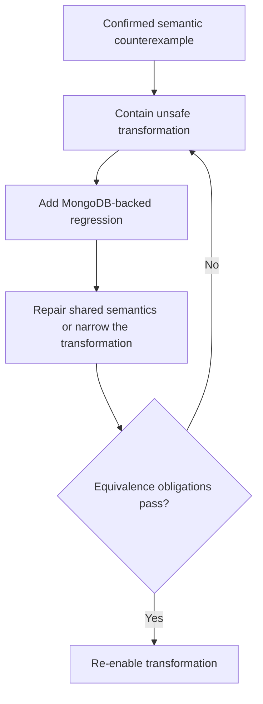
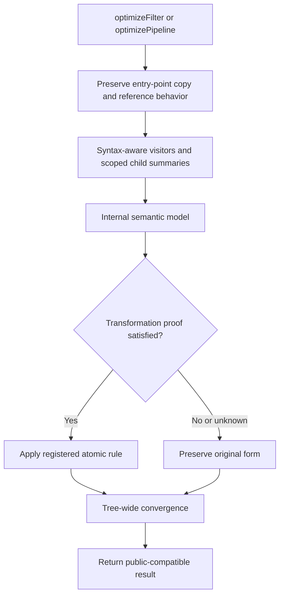
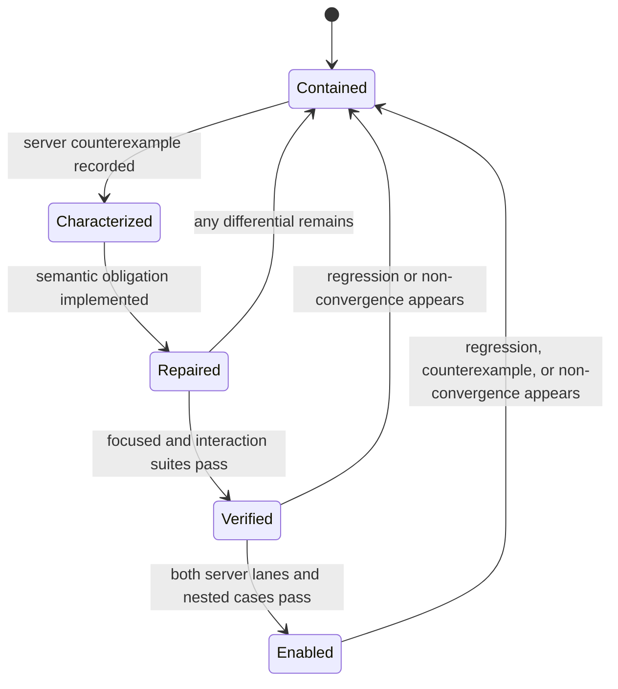
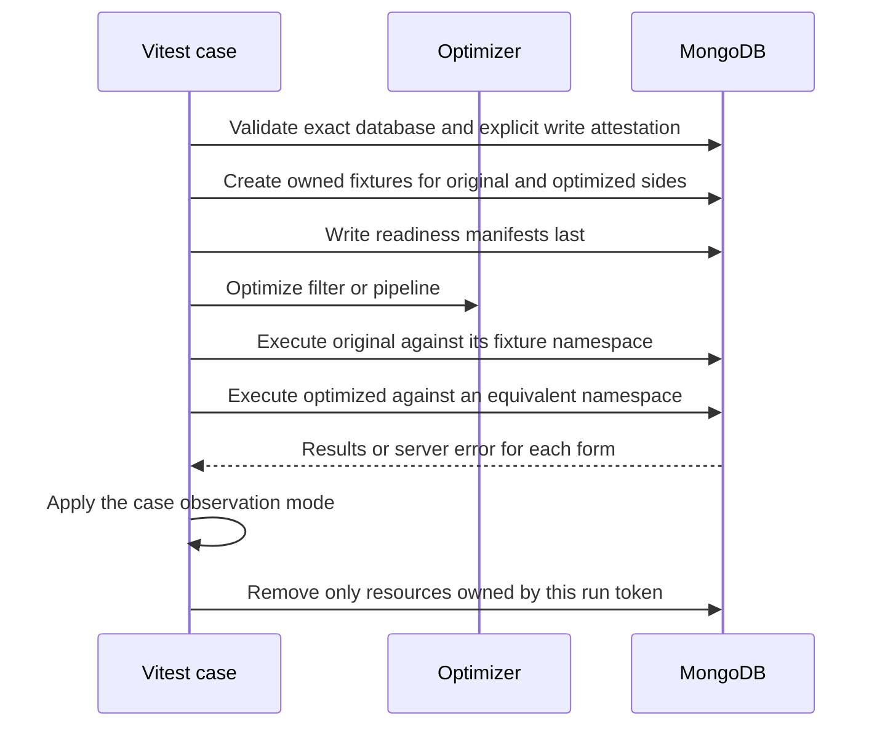

# MongoDB Query Optimizer Correctness Recovery - Plan

## Goal Capsule

- **Objective:** Restore semantics-preserving optimization across supported filters, pipelines, and recursively optimized nested pipelines while covering every verified correctness failure, brittle edge, missed optimization, and test-oracle gap found by the audit.
- **Product authority:** Downstream optimizer calls remain alpha-gated. Semantic equivalence outranks optimization coverage, and unsafe transformations may remain disabled until proven safe.
- **Open blockers:** None. The maintained MongoDB matrix and containment granularity are settled in the Planning Contract.

---

## Product Contract

### Summary

Preserve the public API while placing filter and pipeline optimization on an identity-safe baseline.
Reintroduce rewrites through a conservative semantic model and MongoDB-backed gates across top-level and nested pipelines.

### Problem Frame

The current 72-test suite passes, but its in-memory executor does not model enough MongoDB behavior to establish semantic equivalence.
Source audits, targeted probes, and MongoDB-backed counterexamples confirmed at least 18 semantic failure families that can silently change document membership, multiplicity, field presence, field values, ordering, or pipeline validity.

A supplemental matrix on MongoDB 8.3.8 reproduced a semantic differential or one-call convergence failure in all 29 audited checks while the 72 mock-backed tests remained green.

Downstream calls are made experimentally behind a query-optimizer flag, and no production incident was supplied for prioritization.
Recovery therefore prioritizes silent wrong-result risk and the breadth of each unsafe transformation.

### Key Decisions

- **Contain before repair.** (session-settled: user-approved — chosen over keeping every pass active while applying isolated fixes: the failures share semantic-model gaps that make symptom patches fragile.) Governs R1, R2, and R17.
- **MongoDB behavior is authoritative.** (session-settled: user-approved — chosen over relying on the passing in-memory suite: the mock omits behaviors involved in confirmed failures.) Governs R3, R13, R14, and R15.
- **Recover the full audited surface.** (session-settled: user-directed — chosen over a correctness-only audit: correctness, missed optimizations, brittle edges, and test gaps were all requested.) Governs R4 through R16.
- **Uncertainty blocks transformation.** A construct is preserved when equivalence cannot be proven from available semantic information. Governs R5 through R12.

### Actors

- A1. Package maintainers decide containment, repair, and re-enablement.
- A2. Downstream callers receive optimized filters and pipelines and must not observe changed MongoDB behavior.
- A3. MongoDB verification environments provide the semantic authority for regression and differential checks.

### Requirements

**Containment and authority**

- R1. Downstream execution must remain alpha-gated and must not enable the optimizer by default before R17 is satisfied.
- R2. A transformation with a confirmed counterexample must be disabled or constrained until its equivalence obligation is covered and passing.
- R3. Real MongoDB behavior is the correctness authority; the in-memory executor may supplement but never replace server-backed verification.

**Semantic contract**

- R4. For supported valid deterministic inputs, optimization must preserve document membership, multiplicity, field values, field presence, observable order, and pipeline validity.
- R5. Unknown, dynamic, or incompletely modeled semantics must act as conservative barriers rather than evidence that stages commute.
- R6. Stage analysis must account for reads, writes, removals, produced-field visibility, projection absence, parent-child paths, cardinality, ordering, and stream provenance.
- R7. Filter rewrites must remain equivalent for scalar and multikey fields, regex and BSON values, logical identities, BSON document order, and input key order.
- R8. Expression dependency analysis and alias rewriting must respect MongoDB syntax and scope, including direct field paths, `$$ROOT`, `$$CURRENT`, `$getField`, `$expr`, and `$elemMatch`.
- R9. Projection transformations must preserve inclusion and exclusion mode, `_id` behavior, omitted-field shielding, nested-path semantics, and valid non-colliding specifications.
- R10. Lookup and unwind stages must not be removed without proof that document membership and multiplicity remain unchanged, including wildcard and parent-path consumers.
- R11. Deferred computations must not cross dependency mutations or row-producing stages, and temporary dependencies must not change final field presence or projection validity.
- R12. Direct `$facet`, `$lookup.pipeline`, and object-form `$unionWith.pipeline` arrays must receive the same guarantees as top-level pipelines, and one optimization call must reach the supported fixed point.

**Verification and recovery**

- R13. Every verified semantic failure family must have a focused regression that compares original and optimized behavior.
- R14. The regression corpus must execute against supported MongoDB servers and compare results, multiplicity, field absence, ordering where observable, and server acceptance.
- R15. Existing mock expectations that encode non-MongoDB behavior must be corrected, and nested-pipeline tests must assert behavior rather than transformed structure alone.
- R16. Recovery must include the audited missed optimizations and brittle boundaries: convergence, liveness kills, graph-lookup metadata, limit and skip values, nondeterministic expressions, and erroring expressions.
- R17. A transformation may be re-enabled only after its focused regressions, representative pass-interaction cases, and nested-pipeline cases pass with no unresolved high-severity semantic differential.

### Confirmed Failure Coverage

The R13 corpus covers at least these audited families; related manifestations remain grouped under their shared semantic obligation.

**Filter semantics**

- A match-all branch inside a mixed `$or` is dropped instead of dominating the disjunction.
- Mixed top-level logical and field conditions can lose a condition based on key order.
- Explicit `$eq` values, including regex and operator-shaped documents, are converted into different predicates.
- JSON-based de-duplication conflates distinct regex and other lossy BSON values.
- Intersecting `$in` predicates is unsound for multikey fields.
- Set intersection ignores BSON document field order.

**Stage movement and stream behavior**

- Removals cross writes and resurrect fields.
- Destructive stages cross writes and leak or discard output fields.
- Row-generating stages cross transforms that should apply only before or after generated rows.

**Projection behavior**

- `_id`-only and scalar, array, or empty-object computed projections are misclassified.
- Parent and child paths are treated as interchangeable field coverage.
- Inclusion projections can be pruned or removed despite shielding omitted fields.
- Adjacent projection merging can resurrect nested fields, change `_id` behavior, or create invalid projections.

**Expression and alias scope**

- `$$ROOT`, `$$CURRENT`, and implicit `$getField` reads are omitted from dependencies.
- `$expr` references are pushed without the required alias rewrite.
- `$elemMatch` element-relative keys are rewritten as root aliases.

**Deferral and lookup behavior**

- Complex projection deferral crosses dependency writes or row-producing stages.
- Dependency preservation can introduce path collisions or remove intended output fields.
- Lookup plus preserving unwind is removed without proving lookup uniqueness.
- Null matching copied before a preserving unwind can drop empty-array inputs.
- Lookup elimination ignores wildcard consumers and parent reads of dotted aliases.

**Recursion and convergence**

- Unsafe transformations propagate into recursively optimized nested pipelines.
- Nested optimization and the global iteration cap can leave one-call output non-idempotent.

### Recovery Flow

### Key Flows

- F1. Correctness recovery
  - **Trigger:** A confirmed counterexample exists for an active transformation.
  - **Actors:** A1, A3
  - **Steps:** Contain the transformation, preserve the counterexample as a server-backed regression, repair or narrow its semantic rule, then evaluate the R17 gate.
  - **Outcome:** The transformation remains disabled until equivalence is demonstrated.
  - **Covers:** R2, R3, R13, R14, R17
- F2. Conservative optimization
  - **Trigger:** A2 submits a supported filter or pipeline.
  - **Actors:** A2, A3
  - **Steps:** Analyze effects and dependencies, apply only proven transformations, recursively apply the same contract to nested pipelines, and preserve uncertain constructs.
  - **Outcome:** The optimized input remains MongoDB-equivalent to the original.
  - **Covers:** R4 through R12

### Acceptance Examples

- AE1. Match-all disjunction
  - **Covers R7, R13.**
  - **Given:** A filter contains `$or: [{}, { a: 1 }]`.
  - **When:** The filter is optimized.
  - **Then:** It remains match-all rather than becoming `{ a: 1 }`.
- AE2. Multikey conjunction
  - **Covers R7, R13.**
  - **Given:** Two consecutive `$in` predicates can be satisfied by different elements of one array field.
  - **When:** Their matches are optimized.
  - **Then:** Both predicates remain effective and the matching document is retained.
- AE3. Write and removal ordering
  - **Covers R4, R6, R9.**
  - **Given:** A stage writes a field and a later stage removes or excludes it.
  - **When:** Stage reordering is considered.
  - **Then:** The stages do not cross if doing so would resurrect the field.
- AE4. Lookup multiplicity
  - **Covers R4, R10, R13.**
  - **Given:** One input document joins to two foreign documents before a preserving unwind.
  - **When:** The lookup result is discarded downstream.
  - **Then:** Optimization preserves the two output rows unless a valid uniqueness proof exists.
- AE5. Scoped dependencies
  - **Covers R6, R8.**
  - **Given:** A predicate or expression reads through `$$ROOT`, `$$CURRENT`, `$getField`, `$expr`, or `$elemMatch`.
  - **When:** A preceding write, projection, or alias is analyzed.
  - **Then:** The dependency is interpreted in its correct scope and blocks or enables movement accordingly.
- AE6. Projection deferral
  - **Covers R9, R11.**
  - **Given:** A computed projection depends on a field changed later or retained through a parent path.
  - **When:** Deferral past sort, limit, or skip is considered.
  - **Then:** The computation is not moved across the change and no colliding temporary path or final-field removal is introduced.
- AE7. Nested parity
  - **Covers R12, R15.**
  - **Given:** A confirmed top-level counterexample appears inside a facet, lookup, or union sub-pipeline.
  - **When:** The outer pipeline is optimized once.
  - **Then:** Nested behavior remains equivalent and a second optimization call makes no further change.
- AE8. Re-enablement gate
  - **Covers R2, R17.**
  - **Given:** A transformation has been repaired.
  - **When:** Its focused, interaction, or nested regression still differs from MongoDB behavior.
  - **Then:** The transformation remains contained.

### Success Criteria

- Every R13 counterexample passes against each supported MongoDB verification target.
- No known high-severity semantic differential remains in focused, interaction, or nested regression coverage.
- Supported pipelines are stable after one optimization call.
- Existing safe behavior remains covered after incorrect mock assumptions are removed.
- Downstream optimizer execution remains gated until R17 is satisfied.

### Scope Boundaries

**In scope**

- All verified correctness failures and their shared semantic causes.
- Missed optimizations and brittle edges identified by this audit after the correctness baseline is restored.
- Server-backed and focused test coverage for top-level and recursively optimized pipelines.
- Containment needed to prevent unsafe transformations from being enabled during recovery.

**Out of scope**

- Enabling the optimizer by default or declaring it production-ready as part of this work.
- New optimization families unrelated to the audited behavior.
- Unrelated refactoring of downstream consumers.

### Dependencies and Assumptions

- A real MongoDB environment is available for semantic verification.
- Maintained verification targets MongoDB Server 7.0 and 8.0; newer servers may provide supplemental evidence without replacing those lanes.
- The optimizer currently has no uniqueness metadata sufficient to prove that lookup plus unwind cannot multiply rows.
- No production incident was provided; severity is based on demonstrated semantic impact and affected surface area.

### Sources and Research

- `src/index.ts` — pass orchestration, fixed-point behavior, and nested-pipeline recursion.
- `src/filter-optimizer.ts` — filter simplification and condition merging.
- `src/analyzer/` — stage effects and expression dependencies.
- `src/passes/helpers.ts` — shared commutativity and alias-rewrite logic.
- `src/passes/` — transformation-specific behavior.
- `tests/optimizer.test.ts` — current regression corpus and in-memory executor.
- [MongoDB aggregation pipeline stages](https://www.mongodb.com/docs/manual/reference/operator/aggregation-pipeline/)
- [MongoDB query selectors](https://www.mongodb.com/docs/manual/reference/operator/query/)
- [MongoDB Node.js driver compatibility](https://www.mongodb.com/docs/drivers/node/current/reference/compatibility/)
- [Run MongoDB Community Edition with Docker](https://www.mongodb.com/docs/manual/tutorial/install-mongodb-community-with-docker/)
- [Aggregation pipeline optimization](https://www.mongodb.com/docs/manual/core/aggregation-pipeline-optimization/)

---

## Planning Contract

**Product Contract preservation:** Product Contract unchanged.

### Key Technical Decisions

- KTD1. **Start from whole-optimizer containment.** (session-settled: user-approved — chosen over family-by-family quarantine: shared analyzer and rewrite defects make partial containment hard to audit.) Put both public optimization entry points on an identity-safe baseline, then enable only atomic transformations whose proof suites pass.
- KTD2. **Keep richer semantics internal.** Preserve the observable `getStageInfo` return shape through a one-way compatibility adapter. Internal analyzers and passes consume the richer model directly.
- KTD3. **Use syntax-aware visitors and scoped child summaries.** Analyze predicates, expressions, projections, and field paths with context-specific visitors. Compose nested-pipeline dependencies, errors, determinism, cardinality, and provenance without flattening them through `StageInfo`.
- KTD4. **Require transformation-specific proofs.** Replace generic priority swapping with obligations for commute, rewrite, duplicate, merge, eliminate, and deferral rules. Each proof covers reads, writes, removals, visibility, cardinality, order, provenance, determinism, and errors.
- KTD5. **Converge over the complete pipeline tree before re-enablement.** Run one post-order scheduler over outer and nested pipelines. Capture one pristine tree and return it globally when BSON-aware fingerprints detect a cycle or the safety budget expires.
- KTD6. **Use a URI-driven, resource-isolated server oracle.** (session-settled: user-approved — chosen over embedded downloads and the handwritten executor: MongoDB behavior is the semantic authority.) Bind to the exact authorized database, require an explicit write attestation, isolate every run, case, and comparison side, and never perform an automated whole-database drop.
- KTD7. **Maintain two server lanes.** (session-settled: user-approved — chosen over local-only testing: server-version drift must be visible.) Run MongoDB 7.0 and 8.0 on Node 24 with the MongoDB Node.js driver 7.6 as a locked dev dependency. Use official UBI9-slim Community Server images pinned by digest.
- KTD8. **Re-enable test-first.** An atomic transformation ID enters its private rule registry only after focused, interaction, and applicable nested differential cases pass on both maintained server lanes.

### High-Level Technical Design

The public API remains stable while internal decisions move through syntax-aware analysis and explicit proof gates.

Transformation families move through a containment gate rather than becoming active when their implementation merely compiles.

The differential oracle gives each form independent equivalent fixtures and classifies server errors as observable behavior.

### Implementation Constraints

- Treat the current uncommitted modular source as the implementation baseline; do not overwrite unrelated user changes.
- Keep `optimizeFilter`, `optimizePipeline`, and the observable `getStageInfo` result backward-compatible.
- Preserve entry-point-specific copy and reference behavior; identity containment means no rewrite and no caller-input mutation.
- Keep the MongoDB driver out of runtime dependencies and the published bundle.
- Do not edit `old/` or ignored generated `dist/`; regenerate package output only through the build.
- Do not store the supplied MongoDB URI, username, password, or host in source, fixtures, workflow files, documentation, or snapshots.
- Automated integration tests may write only to the exact authorized database and may remove only run-token-owned resources.
- Preserve invalid, unknown, volatile, or potentially erroring constructs when no equivalence proof exists.

### Delivery Sequence

1. U1 establishes containment and the compile baseline.
2. U2 lands the real-server oracle and maintained CI matrix.
3. U3 builds the semantic model.
4. U8 establishes the sole tree-wide scheduler before any transformation is re-enabled.
5. U4 through U7 recover filter, movement, projection, and lookup rules behind atomic proof gates.
6. U9 closes brittle edges and performs the final registry review.

### Risks and Mitigations

- **Comparator false confidence:** One equality strategy cannot cover every case. Assign ordered BSON, multiset, acceptance/error, or structural-barrier observation per fixture.
- **Remote data loss:** A database-name prefix cannot prove disposability. Require the exact authorized name, URI/environment agreement, and explicit write attestation; never automate `dropDatabase`.
- **Cross-run contamination:** Parallel or interrupted runs can share fixtures. Give each run, case, and comparison side token-owned namespaces and write readiness metadata only after seeding succeeds.
- **Stale cleanup:** A delayed teardown can remove a newer run's data. Revalidate the ownership token and remove only resources tagged by the current run.
- **Version drift:** Mutable container tags can change server behavior. Pin official images by digest and update each digest through reviewed dependency maintenance.
- **Conservative performance regression:** Whole-optimizer containment reduces optimization coverage. Accept this until each family satisfies R17; correctness remains the higher authority.
- **Pass interaction cycles:** Individually safe rewrites can oscillate. Detect repeated structural states and fall back to the original pipeline tree.
- **Working-tree conflicts:** Most modular source is currently uncommitted. Read the latest file before each edit and keep plan work scoped away from unrelated changes.

### System-Wide Impact

- Downstream `mongodb-model` callers keep the same imports and remain protected by the existing experimental flag.
- Package consumers receive no new runtime dependency or configuration requirement.
- Maintainers gain explicit unit, integration, and full-suite commands; only integration and full-suite execution require MongoDB.
- CI gains database service jobs and immutable image inputs.

---

## Implementation Units

### U1. Establish containment and a clean baseline

- **Goal:** Put both public optimization entry points on an identity-safe baseline with no active rewrites while preserving public behavior and the current modular work.
- **Requirements:** R1, R2, R4, R5, R17; F1; AE8.
- **Dependencies:** None.
- **Files:** `src/index.ts`, `src/filter-optimizer.ts`, `src/filter-rule-registry.ts` (new), `src/passes/index.ts`, `src/passes/registry.ts` (new), `src/passes/ordering-stability.ts`, `tsconfig.json`, `tests/containment.test.ts` (new), `tests/optimizer.test.ts`.
- **Approach:**
  1. Introduce separate private registries for atomic pipeline transformations and direct filter rules.
  2. Flatten the composite ordering pass so limit advancement and lookup delay cannot bypass independent containment.
  3. Begin with empty pipeline and filter transformation registries so neither public optimization entry point performs a rewrite, while preserving each entry point's existing copy and reference behavior.
  4. Preserve shared BSON and class-instance leaves by requiring every enabled transformation to be pure.
  5. Keep the unreferenced manual `src/test.ts` probe outside production type checking without modifying that user-owned file.
- **Execution note:** Add failing containment characterizations before changing the active pass set.
- **Patterns to follow:** Keep scheduler-facing objects behind the existing `PipelinePass` interface and preserve the current entry-point boundaries.
- **Test scenarios:**
  1. Representative filters and pipelines remain structurally unchanged at the containment checkpoint because both production registries are empty.
  2. Unknown stages, dynamic expressions, BSON values, dates, buffers, and regular expressions preserve their existing root and leaf reference behavior.
  3. The optimizer never mutates the input object, including nested pipeline arrays.
  4. `getStageInfo` still exposes the existing keys and value types for known, malformed, and unknown stages.
  5. An atomic transformation ID that is not in its private registry cannot run.
  6. Limit advancement and lookup delay can be enabled or disabled independently.
- **Verification:** Source type checking succeeds, public exports remain unchanged, both production registries are empty, and neither public optimization entry point rewrites any audited form.

### U2. Add the MongoDB differential oracle and CI matrix

- **Goal:** Make real MongoDB behavior the executable correctness authority.
- **Requirements:** R3, R13, R14, R15, R17; F1; AE1 through AE8.
- **Dependencies:** U1.
- **Files:** `package.json`, `package-lock.json` (existing ignored artifact to unignore and regenerate), `.gitignore`, `tsconfig.test.json` (new), `vitest.config.ts` (new), `.github/workflows/ci.yml` (new), `tests/helpers/mock-engine.ts` (new), `tests/helpers/mongodb-oracle.ts` (new), `tests/fixtures/semantic-cases.ts` (new), `tests/mongodb-differential.integration.test.ts` (new), `tests/optimizer.test.ts`.
- **Approach:**
  1. Add the MongoDB driver as an exact, dev-only dependency and add unit, integration, full-suite, type-check, and build scripts.
  2. Define separate Vitest unit and integration projects so `npm test` cannot discover server-backed files.
  3. Type-check source and test projects, including fixtures, oracle helpers, and workflow-facing configuration.
  4. Move the handwritten executor into a test helper and limit it to fast structural coverage.
  5. Require `MONGODB_URI`, the exact `MONGODB_TEST_DATABASE=webergency_mongodb_query_optimizer`, a run ID, and an explicit write attestation. Reject a URI database component that is neither absent nor the exact target; never derive the target from `authSource`.
  6. Create token-owned collection namespaces for each run, case, and comparison side. Write a readiness manifest last and never call `dropDatabase` from the automated harness.
  7. Give original and optimized forms independent equivalent fixtures. Reject write-capable stages from differential cases unless their outputs are independently isolated.
  8. Select ordered BSON, multiset, acceptance/error, or structural-barrier observation per case.
  9. Remove only current-token resources after revalidating ownership; stale or repeated teardown is a no-op.
  10. Add Node 24 CI jobs for MongoDB 7.0 and 8.0 with digest-pinned official UBI9-slim images.
  11. Stop deleting the lockfile from package maintenance scripts so CI can use reproducible installs.
- **Execution note:** Build the server-backed cases from the confirmed counterexamples before repairing any transformation.
- **Patterns to follow:** Keep Vitest as the runner and use the package's existing `npm` scripts as the command surface.
- **Test scenarios:**
  1. Exact-name validation accepts the authorized database and rejects suffixes, prefixes, case changes, whitespace, privileged names, URI/environment mismatches, and missing write attestation before any write occurs.
  2. Concurrent runs use disjoint namespaces; a stale owner cannot seed, execute, or remove another run's resources.
  3. A failure after any seed phase leaves no readiness manifest, prevents case execution, and is recovered by the next owned run.
  4. Reversing original and optimized execution order produces the same comparison result.
  5. Delayed and repeated teardown removes only resources still owned by the current token.
  6. Filter cases cover mixed match-all `$or`, logical/field key order, explicit regex and operator-shaped equality, regex de-duplication, multikey `$in`, and BSON document order.
  7. Movement and projection cases cover write/remove conflicts, destructive shielding, parent-child paths, projection modes, path collisions, and invalid empty projections.
  8. Expression cases cover `$$ROOT`, `$$CURRENT`, shorthand `$getField`, `$expr` alias rewriting, and `$elemMatch` scope.
  9. Deferral cases cover dependency writes, unioned rows, volatile expressions, erroring expressions, and temporary-path cleanup.
  10. Lookup cases cover one-to-many multiplicity, preserved empty arrays, wildcard consumers, and dotted alias parent reads.
  11. Nested copies of representative failures execute inside facet, lookup, and union sub-pipelines.
  12. The observation modes distinguish absent from `null`, duplicate rows from one row, ordered streams from multisets, server error from successful empty output, and volatile barriers from exact-result cases.
  13. Mock expectations match MongoDB for empty `$count`, preserved empty-array unwind, projection mode, and invalid logical arrays.
- **Verification:** The contained optimizer passes the isolated differential corpus on both maintained lanes, an intentionally unsafe rewrite is detected, and database-guard tests prove no whole-database drop is reachable.

### U3. Introduce the conservative semantic model

- **Goal:** Represent the information required to prove a rewrite without changing the observable `getStageInfo` result.
- **Requirements:** R5, R6, R8, R9, R10, R11, R16; AE3, AE5, AE6.
- **Dependencies:** U1, U2.
- **Files:** `src/analyzer/types.ts`, `src/analyzer/index.ts`, `src/analyzer/utils.ts`, `src/analyzer/semantics.ts` (new), `src/analyzer/paths.ts` (new), `src/analyzer/expressions.ts` (new), `src/analyzer/filters.ts` (new), `src/analyzer/projections.ts` (new), `src/analyzer/stages/match.ts`, `src/analyzer/stages/project.ts`, `src/analyzer/stages/group.ts`, `src/analyzer/stages/lookup.ts`, `src/analyzer/stages/standard.ts`, `tests/analyzer-semantics.test.ts` (new).
- **Approach:**
  1. Model exact, ancestor, descendant, wildcard, removed, and unknown path effects without treating child production as complete parent production.
  2. Model projection mode, `_id`, omitted-field shielding, output visibility, and path collisions.
  3. Model cardinality, order, stream provenance, determinism, potential errors, and unknown semantics as conservative lattice values.
  4. Track document-scoped variables and implicit inputs while respecting lexical and element-relative scopes.
  5. Compose child pipelines in their own field, variable, and stream scopes and expose only externally relevant dependencies and effects.
  6. Project the internal result through a one-way public adapter that returns fresh Sets and no new fields.
- **Execution note:** Implement analyzer tests before changing any pass that consumes the new model.
- **Patterns to follow:** Keep one adapter per aggregation stage in `src/analyzer/stages/` and make unknown adapters produce the conservative top value.
- **Test scenarios:**
  1. Exact, ancestor, descendant, sibling, and wildcard path relations produce distinct read and visibility outcomes.
  2. `_id`-only, scalar, array, empty-object, inclusion, exclusion, and computed projections receive the correct mode and visibility.
  3. `$$ROOT`, `$$CURRENT`, path-qualified document variables, and shorthand `$getField` record their document dependencies.
  4. `$expr` uses expression scope while `$elemMatch` keys remain element-relative.
  5. Match, unwind, group, count, sample, union, densify, lookup, and facet expose correct cardinality, order, and provenance effects.
  6. `$graphLookup` records only `startWith` as an outer dependency and places `depthField` inside the joined output.
  7. `$rand`, `$function`, divide-by-zero-capable expressions, and unsupported operators block movement or elimination.
  8. Facet, lookup, and union child summaries keep local and foreign dependencies separate while propagating observable errors, cardinality, and determinism.
  9. `getStageInfo` retains its existing keys, value types, and conservative unknown behavior.
- **Verification:** Analyzer unit tests pass, the internal result distinguishes safe, conflicting, and unknown effects, and the public adapter exposes no internal-only fields.

### U8. Establish tree-wide scheduling and convergence

- **Goal:** Make one global scheduler responsible for outer and nested transformations before any rule is re-enabled.
- **Requirements:** R4, R5, R12, R13, R17; F2; AE7, AE8.
- **Dependencies:** U2, U3.
- **Files:** `src/index.ts`, `src/utils.ts`, `src/passes/ordering-stability.ts`, `src/passes/registry.ts`, `tests/convergence-and-interactions.test.ts` (new), `tests/optimizer.test.ts`, `tests/fixtures/semantic-cases.ts`.
- **Approach:**
  1. Traverse facet, lookup, and object-form union sub-pipelines post-order inside one deterministic scheduler.
  2. Remove pass-local convergence loops so every atomic rule participates in the same state history and safety budget.
  3. Capture one pristine complete-tree clone before scheduling.
  4. Use BSON-aware structural fingerprints to detect fixed points and repeated non-fixed states.
  5. Return the pristine tree globally on a cycle or exhausted budget so fallback itself is one-call idempotent.
- **Execution note:** Land this unit while all transformation registries remain empty.
- **Patterns to follow:** Reuse the existing nested-pipeline discovery points, but replace recursive public-entry calls with scoped child scheduling.
- **Test scenarios:**
  1. The known facet case reaches the same structure after one and two calls.
  2. Nested changes participate in the next outer sweep without a second public invocation.
  3. A pipeline with more than 100 local rewrite opportunities either reaches a fixed point or returns the pristine tree.
  4. A deliberate two-state oscillation triggers global fallback and remains stable on the next call.
  5. BSON values, regexes, document key order, and class instances produce stable fingerprints without JSON loss.
  6. No composite or pass-local loop can execute a contained atomic rule.
- **Verification:** Empty registries return the entry-point-compatible contained form, and scheduler characterization proves global one-call idempotence before U4 through U7 begin.

### U4. Recover safe filter rewrites

- **Goal:** Re-enable only query rewrites that preserve MongoDB filter semantics without schema or collation knowledge.
- **Requirements:** R4, R5, R7, R8, R13, R15, R17; AE1, AE2, AE5.
- **Dependencies:** U2, U3, U8.
- **Files:** `src/filter-optimizer.ts`, `src/filter-rule-registry.ts`, `src/utils.ts`, `src/analyzer/filters.ts`, `src/passes/filter-optimization.ts`, `src/passes/adjacent-match-merging.ts`, `src/passes/registry.ts`, `tests/filter-optimizer.test.ts` (new), `tests/fixtures/semantic-cases.ts`, `tests/optimizer.test.ts`.
- **Approach:**
  1. Preserve logical identities and represent mixed top-level conditions as conjunctions without overwrite behavior.
  2. Keep explicit `$eq`, singleton `$in`, multikey conjunctions, collation-sensitive comparisons, and exotic BSON values when equivalence is not provable.
  3. Replace JSON de-duplication and context-free equality with query-aware BSON comparison.
  4. Enable each simplification rule separately after its server-backed obligations pass.
- **Execution note:** Recover rules one at a time; do not restore the previous optimizer wholesale.
- **Patterns to follow:** Use the filter visitor from U3 and the active-rule registry from U1.
- **Test scenarios:**
  1. `$or: [{}, { a: 1 }]` remains match-all, while an invalid empty logical array remains unchanged and preserves the server error.
  2. `{ $and: [{ a: 1 }], a: 2 }` retains both predicates regardless of insertion order.
  3. Explicit equality to a regex or operator-shaped document remains explicit.
  4. Distinct regular expressions and lossy BSON values are not de-duplicated.
  5. Consecutive `$in` predicates on an array field may be satisfied by different elements and are not intersected without scalar proof.
  6. Embedded documents with different key order remain distinct query values.
  7. Safe primitive identities and flattening cases still optimize and remain equivalent on both server lanes.
- **Verification:** Direct filter calls and filter-bearing pipeline passes pass focused and generated differential cases before their rules enter the registry.

### U5. Recover proven stage movement

- **Goal:** Move stages only when the specific pair satisfies all semantic obligations.
- **Requirements:** R4, R5, R6, R8, R12, R13, R16, R17; AE3, AE5, AE7.
- **Dependencies:** U3, U4, U8.
- **Files:** `src/passes/helpers.ts`, `src/passes/match-pushdown.ts`, `src/passes/stage-priority-reorder.ts`, `src/passes/limit-advance.ts`, `src/passes/registry.ts`, `tests/stage-movement.test.ts` (new), `tests/fixtures/semantic-cases.ts`, `tests/optimizer.test.ts`.
- **Approach:**
  1. Replace the generic `canSwap` decision with atomic commute, rewrite, and duplicate proof functions.
  2. Block movement across conflicting reads, writes, removals, visibility changes, cardinality changes, order boundaries, stream provenance changes, and unknown effects.
  3. Rewrite aliases through syntax-aware query and expression visitors.
  4. Treat preserved unwind plus null matching, `$text`, volatile expressions, and potentially erroring expressions as barriers unless a dedicated proof exists.
- **Execution note:** Characterize each movement pass independently before testing pass interactions.
- **Patterns to follow:** Consume the U3 semantic result and preserve existing pass classes where their responsibilities remain valid.
- **Test scenarios:**
  1. Add-then-unset, add-then-inclusion-project, add-then-count, and lookup-then-project do not swap when output fields would leak or disappear.
  2. Parent reads do not move across child-only projections.
  3. `$expr` aliases rewrite field-reference strings, while `$elemMatch` inner keys retain element scope.
  4. A null match after a preserving unwind does not gain an early predicate that rejects empty arrays.
  5. Sort-, limit-, skip-, sample-, and stream-dependent stages preserve observable order and evaluation count.
  6. Unknown stages and whole-document consumers stop movement.
  7. Existing safe direct-field match pushdown and passive-stage movement cases still optimize on both server lanes.
- **Verification:** Each enabled movement rule has focused unit proof, pass-interaction proof, and a server differential with both matching and non-matching fixtures.

### U6. Recover projection, pruning, merging, and deferral

- **Goal:** Preserve projection visibility and expression timing while recovering safe field reduction.
- **Requirements:** R4, R5, R6, R9, R11, R13, R16, R17; AE3, AE5, AE6.
- **Dependencies:** U3, U5, U8.
- **Files:** `src/analyzer/stages/project.ts`, `src/passes/unused-field-pruning.ts`, `src/passes/adjacent-project-merging.ts`, `src/passes/adjacent-addfield-merging.ts`, `src/passes/complex-projection-deferral.ts`, `src/passes/redundant-projection-elimination.ts`, `src/passes/registry.ts`, `tests/projection-passes.test.ts` (new), `tests/fixtures/semantic-cases.ts`, `tests/optimizer.test.ts`.
- **Approach:**
  1. Preserve inclusion and exclusion mode, `_id`, omitted-field shielding, and ancestor/descendant path behavior through every rewrite.
  2. Merge adjacent computations only when later expressions do not observe earlier writes in the same input document.
  3. Defer an expression only across row-preserving stages that neither alter its dependencies nor change its evaluation count, provenance, determinism, or error timing.
  4. Reject temporary dependency additions that collide with existing paths or require removal of an originally visible field.
  5. Retain unused volatile or potentially erroring expressions unless removing them is part of the supported contract.
- **Execution note:** Use server-backed regression tests before enabling each projection-family pass.
- **Patterns to follow:** Reuse the projection model and path operations from U3 rather than duplicating mode checks in each pass.
- **Test scenarios:**
  1. `_id`-only and constant computed projections continue to remove unspecified fields.
  2. Pruning an inclusion projection never turns it into an exclusion projection or exposes a field read later.
  3. Adjacent projections preserve `_id`, nested exclusions, parent visibility, and a non-empty valid specification.
  4. Adjacent add-field stages do not merge when shorthand `$getField`, `$$CURRENT`, or another expression reads the prior write.
  5. Complex deferral does not cross a dependency overwrite, unset, lookup overwrite, union, densify, unwind, or other row producer.
  6. Parent-plus-child dependency preservation never creates a path collision or removes a retained child afterward.
  7. Safe dead writes killed by a later overwrite or unset are pruned without changing errors or volatile evaluation.
- **Verification:** Projection-family focused tests, interaction tests with movement passes, and server differentials pass before each family enters the active registry.

### U7. Recover lookup and graph-lookup handling

- **Goal:** Preserve join multiplicity, alias visibility, and foreign/local scope.
- **Requirements:** R4, R5, R6, R10, R12, R13, R16, R17; AE4, AE5, AE7.
- **Dependencies:** U3, U5, U6, U8.
- **Files:** `src/analyzer/stages/lookup.ts`, `src/passes/lookup-delay.ts`, `src/passes/redundant-lookup-elimination.ts`, `src/passes/helpers.ts`, `src/passes/registry.ts`, `tests/lookup-passes.test.ts` (new), `tests/fixtures/semantic-cases.ts`, `tests/optimizer.test.ts`.
- **Approach:**
  1. Treat lookup aliases as produced document paths with foreign-stream provenance.
  2. Keep lookup plus unwind whenever uniqueness is unknown; preserving null and empty arrays does not prove multiplicity preservation.
  3. Recognize wildcard, whole-document, parent, child, and expression consumers of an alias.
  4. Analyze lookup sub-pipelines recursively and separate outer `let` dependencies from foreign pipeline fields.
  5. Correct graph-lookup outer dependencies and nested `depthField` placement.
  6. Re-enable lookup delay independently from limit advancement and other movement rules.
- **Execution note:** Assume no lookup uniqueness unless future public metadata provides an explicit proof.
- **Patterns to follow:** Use U3 path/provenance semantics and U5 pair-specific movement checks.
- **Test scenarios:**
  1. Two foreign matches followed by preserving unwind still produce two rows when the alias is discarded later.
  2. Zero, one, and many foreign matches preserve local membership and multiplicity.
  3. `$jsonSchema`, other wildcard consumers, a parent read of a dotted alias, and expression-based reads prevent elimination.
  4. Delaying lookup past an inclusion projection never exposes the alias or loses the local join key.
  5. Lookup `let` reads outer fields, while sub-pipeline match and projection reads remain foreign-scoped.
  6. Graph lookup ignores foreign connect fields as local dependencies and reports depth under the output array.
  7. A safely discarded simple lookup without unwind optimizes only when every error, visibility, and consumer obligation is proven.
- **Verification:** Lookup passes remain contained unless multiplicity and visibility differentials pass on both maintained servers and inside nested pipelines.

### U9. Complete brittle-edge hardening and the final registry review

- **Goal:** Close the remaining audited edges and admit only transformations with complete evidence.
- **Requirements:** R4, R5, R13, R14, R15, R16, R17; F2; AE7, AE8.
- **Dependencies:** U4, U5, U6, U7, U8.
- **Files:** `src/index.ts`, `src/utils.ts`, `src/passes/limit-skip-coalescing.ts`, `src/passes/unused-field-pruning.ts`, `src/filter-rule-registry.ts`, `src/passes/registry.ts`, `tests/convergence-and-interactions.test.ts`, `tests/mongodb-differential.integration.test.ts`, `tests/fixtures/semantic-cases.ts`, `tests/optimizer.test.ts`, `.github/workflows/ci.yml`.
- **Approach:**
  1. Treat overwrite and unset as liveness kills only when error and volatility obligations allow removal.
  2. Coalesce limit and skip only for server-valid, exactly representable values with a safe result.
  3. Migrate remaining feature-bearing assertions from the monolithic suite to their owning family suites without deleting unrelated coverage.
  4. Run deterministic seeded interaction generation across active transformations.
  5. Finalize both atomic registries from focused, interaction, nested, and cross-server evidence.
- **Execution note:** Finish with the full matrix; a single unresolved high-severity differential keeps its owning transformation contained.
- **Patterns to follow:** Use the U8 scheduler and keep family-specific proofs beside their owning pass or filter rule.
- **Test scenarios:**
  1. Large, string, fractional, negative, non-finite, BSON 64-bit, and overflowing limit or skip values are preserved unless MongoDB-valid exact coalescing is proven.
  2. Later overwrite and unset kill unused writes, but `$rand`, `$function`, and potentially throwing expressions remain observable.
  3. Seeded top-level and nested rule combinations preserve results, errors, multiplicity, absence, and observable order on both server lanes.
  4. Volatile cases preserve evaluation placement and server acceptance without comparing independent random results.
  5. Every active atomic transformation maps to focused, interaction, and nested proof cases.
  6. Every existing safe expectation remains owned by either the structural suite or a focused family suite.
- **Verification:** The full differential matrix, existing safe behavior, one-call idempotence, type checking, required coverage, and packaging pass with no unresolved high-severity differential.

---

## Verification Contract

- V1. `npm run typecheck` checks both source and test TypeScript projects with no error.
- V2. `npm test` runs only deterministic unit and structural tests; integration-pattern files are excluded and MongoDB is not required.
- V3. `npm run test:integration` requires `MONGODB_URI`, the exact authorized `MONGODB_TEST_DATABASE`, a run ID, and explicit write attestation. It uses independently seeded, token-owned resources and never drops the database.
- V4. `npm run test:all` runs V1, V2, V3, V5, and V6 in the supported local or CI environment.
- V5. `npm run test:coverage` is a required CI gate, covers every known counterexample, and enforces 100% branch coverage for new semantic-model and atomic-proof modules.
- V6. `npm run build` produces CommonJS, ESM, declarations, and source maps without adding the MongoDB driver to runtime output.
- V7. CI runs V4 on Node 24 against digest-pinned MongoDB 7.0 and 8.0 services.
- V8. An atomic transformation is enabled only when its focused suite, representative interaction suite, applicable nested suite, and both server lanes pass.
- V9. Each fixture declares ordered BSON, multiset, acceptance/error, or structural-barrier observation. Comparison preserves BSON types, embedded-document order, field absence, multiplicity, and observable stream order.
- V10. Supplemental runs on newer servers, including the verified MongoDB 8.3.8 environment, may detect forward-compatibility issues but do not replace V7.

---

## Definition of Done

### Global Completion

- The public API and observable `getStageInfo` result remain backward-compatible.
- Every confirmed failure family has a durable server-backed regression.
- No known high-severity semantic differential remains in an enabled transformation.
- Unsupported or unproven behavior remains unchanged through conservative containment.
- Top-level and supported nested pipelines are stable after one optimization call.
- Unit, integration, full-suite, coverage, type-check, build, and both maintained server lanes pass.
- The repository contains no connection credentials, the automated harness never drops a database, and cleanup cannot remove resources outside the current ownership token.
- `old/` and generated `dist/` contain no hand edits.
- Abandoned experiments, temporary probes, and superseded helpers are removed from the final diff.

### Unit Completion

- U1 is done when both production transformation registries are empty, neither public optimization entry point performs a rewrite, and the package type-checks without changing exports.
- U2 is done when the isolated oracle detects a seeded unsafe rewrite, proves its ownership guards, and passes the contained corpus on MongoDB 7.0 and 8.0.
- U3 is done when the internal analyzer distinguishes safe, conflicting, and unknown effects while the public adapter preserves its observable shape.
- U8 is done when the sole global scheduler is one-call idempotent with empty transformation registries.
- U4 is done when every enabled atomic filter rule passes direct and pipeline differential coverage and satisfies V8.
- U5 is done when every enabled movement rule has a transformation-specific proof and interaction coverage and satisfies V8.
- U6 is done when projection visibility, path validity, and expression timing remain equivalent for every enabled projection pass and satisfies V8.
- U7 is done when lookup multiplicity and alias scope remain equivalent without assumed uniqueness and satisfies V8.
- U9 is done when brittle-edge coverage passes and both final registries satisfy V8.
