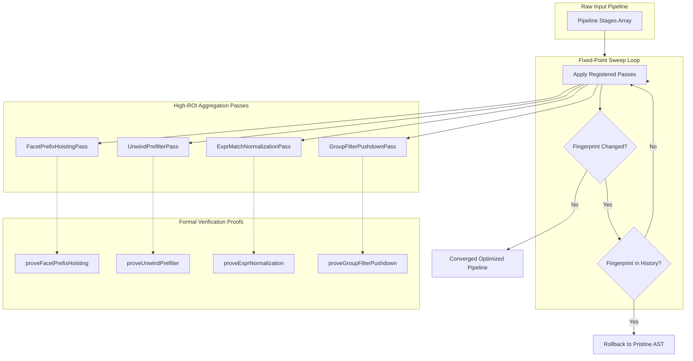

# High-ROI Aggregation Optimizations - Plan

## Goal Capsule

- **Objective:** Reduce server query execution latency, memory pressure, and expanded document volumes across common aggregation patterns by safely hoisting common facet stages, pre-filtering unwound arrays, converting expression matches to native index scans, and pushing group filters before aggregation.
- **Means:** Four targeted compiler passes backed by formal movement and projection proofs integrated into the optimizer registry and fixed-point sweep.
- **Product authority:** Downstream query callers rely on zero semantic regression. Transformations activate only when formal proofs guarantee exact preservation of document membership, multiplicity, ordering, and observable validity.
- **Open blockers:** None.

---

## Product Contract

### Summary
Add a four-pass High-ROI Aggregation Optimization Pack to `@webergency-utils/mongodb-query-optimizer`, comprising `$facet` common-prefix hoisting, `$unwind` `$elemMatch` pre-filtering, `$expr`-to-native `$match` conversion, and `$group` `_id` filter pushdown.

### Problem Frame
Aggregation queries in search, reporting, and ORM-generated workflows frequently emit sub-optimal pipeline structures that force MongoDB to perform redundant work:
- Independent branches inside `$facet` repeat identical filtering and projection scans on the entire collection.
- Expanding arrays via `$unwind` before evaluating downstream `$match` conditions materializes thousands of transient documents only to discard them immediately.
- Queries expressed via `$expr: { $eq: [...] }` fail to leverage standard B-tree collection indexes, degrading indexed lookups into full table scans.
- Grouping aggregations followed by `$match` on the group key scan and aggregate irrelevant documents before discarding their summary rows.

### Key Decisions
- **Full High-Impact Pack.** (session-settled: user-directed — chosen over single-pass tracks: delivers comprehensive pipeline reduction across faceted search, array expansion, and indexed queries together.) Governs R1, R4, R7, R10.
- **Conservative `$unwind` pre-filtering.** (session-settled: user-directed — chosen over aggressive empty-array pruning: injects `$elemMatch` only when a downstream `$match` references the unwound path and `preserveNullAndEmptyArrays` is false, preventing silent cardinality loss.) Governs R4, R5, R6.
- **1-to-1 post-group match elimination.** (session-settled: user-directed — chosen over always retaining post-group filters: eliminates the redundant post-group `$match` stage when the grouping `_id` mapping is a direct 1-to-1 deterministic field path, saving post-aggregation document evaluation.) Governs R10, R11.
- **Full-consensus `$facet` hoisting.** Common prefix stages are hoisted out of `$facet` only when 100% of facet branches share identical leading stages, preventing corruption of non-participating branches. Governs R1, R2, R3.
- **Formal proof integration.** Every rewrite must be guarded by an explicit proof function enforcing 100% branch test coverage. Governs R13, R14.

### <!-- ce-section: work-relationships -->How This Work Fits Together
This plan owns the High-ROI Aggregation Optimization Pack for `@webergency-utils/mongodb-query-optimizer`. Surrounding potential tracks represent future improvements:
- Boolean Filter Algebra: Can proceed independently of this plan; focuses on dead-query contradiction pruning, range intersection, and `$in` deduplication in `src/filter-rule-registry.ts`.
- Quarantined Pass Recovery: Depends on this plan establishing expanded proof primitives; focuses on replacing the contained priority bubble sort with a DAG-based topological scheduler and reviving redundant projection elimination.
- Developer Experience & Tooling: Can proceed independently of this plan; provides `README.md`, `USAGE.md`, TypeScript generic types, and an `explain()` benchmarking harness.

### Actors
- A1. Downstream Application / ORM: Generates or supplies MongoDB aggregation pipelines to `optimizePipeline()`.
- A2. Query Optimizer Engine: Parses, analyzes, verifies proofs, and rewrites AST pipelines into equivalent optimized pipelines.
- A3. MongoDB Server: Executes the resulting pipeline, utilizing indexes and reduced working sets.

### Requirements

**$facet Common-Prefix Hoisting**
- R1. The optimizer must identify identical deterministic leading stages shared across all branches in a `$facet` stage.
- R2. When all facet branches share an identical leading deterministic `$match` or projection stage, the optimizer must hoist the common prefix stages directly before the `$facet` stage and remove them from all inner facet branches.
- R3. If any facet branch does not contain the matching leading stage, or if a leading stage contains non-deterministic expressions (`$rand`, `$function`) or branch-specific variable bindings, the `$facet` stage must remain unhoisted.

**$unwind Pre-filtering**
- R4. When an `$unwind` stage is followed by a `$match` stage referencing paths within the unwound array, the optimizer must synthesize an equivalent `$elemMatch` filter stage placed immediately before the `$unwind`.
- R5. The original `$match` stage after `$unwind` must be preserved to filter the unfolded array elements.
- R6. Pre-filtering must be blocked whenever `preserveNullAndEmptyArrays` is `true`, when `includeArrayIndex` is referenced by downstream filters, or when the unwound path is non-literal or unanalyzable.

**$expr-to-Native $match Conversion**
- R7. The optimizer must rewrite simple equality comparisons within `$expr` (`{ $expr: { $eq: ["$field", <literal>] } }` or `{ $expr: { $eq: [<literal>, "$field"] } }`) into native equality predicates (`{ field: <literal> }`).
- R8. The optimizer must rewrite comparison operators (`$gt`, `$gte`, `$lt`, `$lte`, `$ne`, `$in`) within `$expr` against literal constants into native query operator subdocuments.
- R9. Rewriting must be blocked when an `$expr` compares two document field paths, references system variables (`$$ROOT`, `$$CURRENT`), or contains non-invertible expression logic.

**$group _id Filter Pushdown**
- R10. When a `$group` stage is followed by a `$match` stage filtering on `_id` fields, the optimizer must translate the filter to the source field paths and place the translated `$match` immediately before the `$group`.
- R11. If the `_id` mapping is a direct 1-to-1 deterministic field path (e.g. `_id: "$dept"`), the post-group `$match` stage must be removed. If the `_id` mapping involves complex expressions or conditional operators, the post-group `$match` must be retained as an invariant guard.
- R12. Pushdown must be blocked if the post-group `$match` references accumulator fields (e.g., fields generated by `$sum`, `$avg`, `$push`).

**Correctness, Proofs & Registry Integration**
- R13. Each of the four transformations must be backed by formal proof functions in `src/passes/` that verify commutativity, dependency isolation, and multiplicity preservation before applying any AST modification.
- R14. All new passes must be registered in `src/passes/registry.ts`, participate in the convergent fixed-point sweep with cycle detection, and maintain 100% branch test coverage.

### Key Flows
- F1. Facet Common Prefix Extraction
  - **Trigger:** A pipeline contains a `$facet` stage where every branch begins with `{ $match: { orgId: "123" } }`.
  - **Actors:** A1, A2
  - **Steps:** A2 analyzes all facet branch prefixes; confirms 100% consensus; extracts the common `$match`; splices it before `$facet`; strips the leading stage from all branches.
  - **Outcome:** The `$match` runs once across the collection rather than once per facet thread.
  - **Covered by:** R1, R2, R3
- F2. Unwind ElemMatch Synthesis
  - **Trigger:** A pipeline contains `{ $unwind: "$items" }` followed by `{ $match: { "items.status": "available" } }` with `preserveNullAndEmptyArrays: false`.
  - **Actors:** A1, A2
  - **Steps:** A2 inspects the unwind path and downstream filter; verifies `preserveNullAndEmptyArrays` is not true; synthesizes `{ $match: { items: { $elemMatch: { status: "available" } } } }`; places it before `$unwind`; retains the post-unwind filter.
  - **Outcome:** Documents with empty `items` or items lacking `"available"` status are eliminated before array unwinding.
  - **Covered by:** R4, R5, R6
- F3. Expression Normalization for Index Scan
  - **Trigger:** An incoming filter contains `{ $match: { $expr: { $eq: ["$sku", "ABC-123"] } } }`.
  - **Actors:** A1, A2, A3
  - **Steps:** A2 validates that `$sku` is a field path and `"ABC-123"` is a literal scalar; rewrites the stage to `{ $match: { sku: "ABC-123" } }`.
  - **Outcome:** A3 utilizes a standard B-tree index on `sku` instead of a full collection scan.
  - **Covered by:** R7, R8, R9
- F4. Group Key Pushdown with Redundant Filter Stripping
  - **Trigger:** A pipeline contains `{ $group: { _id: "$dept", total: { $sum: "$amount" } } }` followed by `{ $match: { _id: "Sales" } }`.
  - **Actors:** A1, A2
  - **Steps:** A2 traces `_id` to `$dept`; confirms 1-to-1 deterministic relationship; injects `{ $match: { dept: "Sales" } }` before `$group`; removes `{ $match: { _id: "Sales" } }` after `$group`.
  - **Outcome:** Non-Sales documents are filtered out before aggregation, and no redundant post-group filter is evaluated.
  - **Covered by:** R10, R11, R12

### Acceptance Examples
- AE1. Facet prefix hoisting across uniform branches
  - **Covers R1, R2.**
  - **Given:** A `$facet` stage with branches `a: [{ $match: { x: 1 } }, { $sort: { y: 1 } }]` and `b: [{ $match: { x: 1 } }, { $limit: 10 }]`.
  - **When:** `optimizePipeline()` executes.
  - **Then:** The output pipeline is `[{ $match: { x: 1 } }, { $facet: { a: [{ $sort: { y: 1 } }], b: [{ $limit: 10 }] } }]`.
- AE2. Facet hoisting rejection on partial consensus
  - **Covers R3.**
  - **Given:** A `$facet` stage with branch `a: [{ $match: { x: 1 } }]` and branch `b: [{ $match: { x: 2 } }]`.
  - **When:** `optimizePipeline()` executes.
  - **Then:** The `$facet` stage is returned unmodified.
- AE3. Unwind pre-filtering synthesis
  - **Covers R4, R5.**
  - **Given:** `[{ $unwind: "$orders" }, { $match: { "orders.total": { $gt: 50 } } }]` with default unwind options.
  - **When:** `optimizePipeline()` executes.
  - **Then:** The output pipeline contains `{ $match: { orders: { $elemMatch: { total: { $gt: 50 } } } } }`, followed by `{ $unwind: "$orders" }`, followed by `{ $match: { "orders.total": { $gt: 50 } } }`.
- AE4. Unwind pre-filtering barrier on null preservation
  - **Covers R6.**
  - **Given:** `[{ $unwind: { path: "$orders", preserveNullAndEmptyArrays: true } }, { $match: { "orders.total": { $gt: 50 } } }]`.
  - **When:** `optimizePipeline()` executes.
  - **Then:** No pre-filter is synthesized; the pipeline stages remain in their original positions.
- AE5. Simple expression equality conversion
  - **Covers R7.**
  - **Given:** `{ $match: { $expr: { $eq: ["$category", "books"] } } }`.
  - **When:** `optimizePipeline()` executes.
  - **Then:** The stage is rewritten to `{ $match: { category: "books" } }`.
- AE6. Expression conversion barrier on two-field comparison
  - **Covers R9.**
  - **Given:** `{ $match: { $expr: { $eq: ["$salePrice", "$costPrice"] } } }`.
  - **When:** `optimizePipeline()` executes.
  - **Then:** The `$expr` stage is left unchanged.
- AE7. Group key pushdown with post-match elimination
  - **Covers R10, R11.**
  - **Given:** `[{ $group: { _id: "$userId", count: { $sum: 1 } } }, { $match: { _id: 42 } }]`.
  - **When:** `optimizePipeline()` executes.
  - **Then:** The output pipeline is `[{ $match: { userId: 42 } }, { $group: { _id: "$userId", count: { $sum: 1 } } }]` without a trailing `$match`.
- AE8. Group pushdown barrier on accumulator dependency
  - **Covers R12.**
  - **Given:** `[{ $group: { _id: "$userId", total: { $sum: "$amount" } } }, { $match: { total: { $gt: 100 } } }]`.
  - **When:** `optimizePipeline()` executes.
  - **Then:** The `$match` remains after `$group` and is not pushed before `$group`.

### Scope Boundaries
- **Deferred for later:**
  - Boolean filter algebra enhancements (contradiction elimination, range consolidation, `$in` set minimization).
  - Quarantined pass resurrection (DAG topological scheduler, redundant projection elimination).
  - Aggressive empty-array pruning ahead of `$unwind` when no downstream filter exists.
  - Decorrelation of correlated sub-pipeline lookups into simple equality lookups.
- **Outside this product's identity:**
  - Database-side index creation or collection schema alteration (the optimizer is strictly an AST rewriter).
  - Cost-based optimizer modeling using runtime collection statistics or sampling.

### Success Criteria
- 100% test pass rate across the existing 490+ unit test suite with zero regression.
- 100% branch test coverage maintained on all newly introduced proof functions and passes per `vitest.config.ts`.
- Server-backed semantic equivalence verified via the differential MongoDB 8 oracle suite for all four transformation patterns.
- Measurable working-set reduction on pipelines featuring `$facet`, `$unwind`, and `$group`.

---

## Planning Contract

### Key Technical Decisions
- KTD1. **Dedicated Pass Modules.** Each optimization is implemented in its own pass file under `src/passes/` (`facet-prefix-hoisting.ts`, `unwind-prefilter.ts`, `expr-match-normalization.ts`, `group-filter-pushdown.ts`), paired with dedicated proof functions. Governs R13, R14.
- KTD2. **Structural Equality for Common Prefixes.** Facet prefix hoisting uses `structuralFingerprint` from `src/utils.ts` to guarantee deep BSON-aware equality across all branch prefixes before hoisting. Governs R1, R2, R3.
- KTD3. **Pre-filter Synthesis Order.** In `unwind-prefilter.ts`, the synthesized `$elemMatch` filter is inserted directly ahead of `$unwind`. Existing `match-pushdown` passes will subsequently migrate this filter further upstream if preceding stages permit. Governs R4, R5.
- KTD4. **Strict Expression Inversion Scope.** `$expr` normalization operates only on root-level `$expr` subdocuments containing binary comparison operators with one field path string (`$path`) and one scalar/array literal. Any other expression shape fails the proof closed. Governs R7, R8, R9.
- KTD5. **Direct 1-to-1 Path Traceability for `$group`.** In `group-filter-pushdown.ts`, an `_id` path expression is eligible for post-match stripping if and only if it resolves to a direct string field path (`"$fieldName"`), without operators or nested expressions. Governs R10, R11, R12.

### High-Level Technical Design



### Technical Design Details
1. **Pass Sequencing in `src/passes/registry.ts`:**
   New passes are integrated into `activePipelineTransformationIds` in the following sequence:
   - `expr-match-normalization`: Runs early so that newly normalized `$match` stages can participate in `adjacent-match-merging` and `match-pushdown`.
   - `group-filter-pushdown`: Runs before `match-pushdown` so pushed filters can travel past stages preceding `$group`.
   - `unwind-prefilter`: Runs before `match-pushdown` so synthesized `$elemMatch` filters can advance upwards.
   - `facet-prefix-hoisting`: Runs during stage traversal so common prefixes hoisted out of `$facet` become top-level stages eligible for further pipeline optimization sweeps.
2. **Branch Coverage Thresholds:**
   `vitest.config.ts` will be updated to include each new pass and proof module in `coverage.thresholds` with `{ branches: 100 }`.

### Assumptions
- Pipelines passed to `optimizePipeline()` are valid MongoDB aggregation pipeline structures.
- `$unwind` without `preserveNullAndEmptyArrays` defaults to `preserveNullAndEmptyArrays: false`.
- Comparison expressions in `$expr` adhere to MongoDB's standard argument array signature (`[field, literal]`).

### Risk Analysis & Mitigation
- **Risk:** Synthesizing an `$elemMatch` pre-filter on a field that is sometimes a scalar might reject valid documents or error in MongoDB.
  - **Mitigation:** The proof validates that the field is being targeted by `$unwind`. In MongoDB aggregation, unwinding a non-array produces either an array of one or missing; `$elemMatch` correctly evaluates arrays without throwing type errors.
- **Risk:** Facet hoisting could change document order if a hoisted stage is order-modifying.
  - **Mitigation:** Only deterministic `$match` and projection stages that do not mutate cardinality or reorder streams are permitted in the initial prefix hoist. `$sort` is not hoisted in the first version.

---

## Implementation Units

### U1. Facet Common-Prefix Hoisting Pass & Proof
- **Goal:** Hoist identical deterministic leading stages shared across all branches of a `$facet` stage immediately before the `$facet`.
- **Requirements:** R1, R2, R3, R13, R14; Covers F1 / AE1, AE2.
- **Dependencies:** None.
- **Files:**
  - `src/passes/facet-prefix-hoisting.ts`
  - `src/passes/facet-proofs.ts`
  - `tests/facet-prefix-hoisting.test.ts`
- **Approach:**
  1. Create `src/passes/facet-proofs.ts` exporting `proveFacetPrefixHoisting(stage: any): { hoistedStages: any[]; simplifiedFacet: any } | null`.
  2. Inspect `$facet` branches; verify all branches are non-empty arrays.
  3. Extract leading stage of each branch; calculate `structuralFingerprint` of the first branch's leading stage and verify all other branches have an identical fingerprint.
  4. Verify the candidate stage is a deterministic `$match` or passive `$project` using `analyzeStage` from `src/analyzer/semantics.ts`. Reject if any stage contains non-deterministic functions or local variable dependencies.
  5. If valid, pop the leading stage from all branches, record it in `hoistedStages`, and repeat for subsequent matching stages (maximal prefix).
  6. In `src/passes/facet-prefix-hoisting.ts`, implement `FacetPrefixHoistingPass implements PipelinePass` to splice `hoistedStages` immediately before `$facet`.
- **Patterns to follow:** `src/passes/adjacent-match-merging.ts`, `src/passes/movement-proofs.ts`.
- **Test scenarios:**
  - Happy path: `$facet` with 2 branches sharing identical `{ $match: { org: "A" } }` hoists the `$match` and strips it from both branches (Covers AE1).
  - Happy path: Multiple common leading stages (e.g. `$match` followed by `$project`) hoist in order.
  - Edge case: Partial consensus (2 of 3 branches match) rejects hoisting and returns unchanged pipeline (Covers AE2).
  - Edge case: Single branch `$facet` rejects or leaves intact.
  - Edge case: Empty branch inside `$facet` rejects hoisting.
  - Edge case: Hoisted stage containing `$rand` or `$function` is rejected by proof.
- **Verification:** Unit test suite passes with 100% branch coverage on `facet-prefix-hoisting.ts` and `facet-proofs.ts`.

### U2. Unwind ElemMatch Pre-filtering Pass & Proof
- **Goal:** Synthesize an `$elemMatch` pre-filter before `$unwind` when a downstream `$match` filters on the unwound array path and `preserveNullAndEmptyArrays` is false.
- **Requirements:** R4, R5, R6, R13, R14; Covers F2 / AE3, AE4.
- **Dependencies:** None.
- **Files:**
  - `src/passes/unwind-prefilter.ts`
  - `src/passes/unwind-proofs.ts`
  - `tests/unwind-prefilter.test.ts`
- **Approach:**
  1. Create `src/passes/unwind-proofs.ts` exporting `proveUnwindPrefilter(unwindStage: any, matchStage: any): { prefilterStage: any } | null`.
  2. Inspect `$unwind` specification: string path (e.g. `"$items"`) or object `{ path: "$items", preserveNullAndEmptyArrays?: boolean, includeArrayIndex?: string }`.
  3. Verify `preserveNullAndEmptyArrays` is not `true`.
  4. Check if `$match` contains conditions on paths rooted at the unwound path.
  5. If conditions exist, translate the child property filters into an `{ [arrayField]: { $elemMatch: subfilter } }` match stage.
  6. Reject if the downstream filter references `includeArrayIndex` or whole-document variables.
  7. In `src/passes/unwind-prefilter.ts`, insert the synthesized prefilter stage immediately ahead of `$unwind` while keeping the downstream `$match` intact.
- **Patterns to follow:** `src/passes/movement-proofs.ts`, `src/analyzer/filters.ts`.
- **Test scenarios:**
  - Happy path: Simple string unwind `"$items"` followed by `{ "items.active": true }` synthesizes `{ items: { $elemMatch: { active: true } } }` before `$unwind` (Covers AE3).
  - Happy path: Object-form unwind `{ path: "$items", preserveNullAndEmptyArrays: false }` produces valid `$elemMatch` pre-filter.
  - Edge case: Object-form unwind with `preserveNullAndEmptyArrays: true` blocks pre-filtering (Covers AE4).
  - Edge case: `$match` filtering on `includeArrayIndex` blocks pre-filtering.
  - Edge case: `$match` containing conditions unrelated to the unwound array leaves unrelated conditions in post-match only.
- **Verification:** Unit tests pass with 100% branch coverage on `unwind-prefilter.ts` and `unwind-proofs.ts`.

### U3. Expr-to-Native Match Normalization Pass & Proof
- **Goal:** Convert `$expr` statements containing simple comparisons against literal constants into native indexable query filter objects.
- **Requirements:** R7, R8, R9, R13, R14; Covers F3 / AE5, AE6.
- **Dependencies:** None.
- **Files:**
  - `src/passes/expr-match-normalization.ts`
  - `src/passes/expr-normalization-proofs.ts`
  - `tests/expr-match-normalization.test.ts`
- **Approach:**
  1. Create `src/passes/expr-normalization-proofs.ts` exporting `proveExprToNativeMatch(exprObject: any): Record<string, any> | null`.
  2. Inspect the operator in `$expr`: support `$eq`, `$ne`, `$gt`, `$gte`, `$lt`, `$lte`, `$in`.
  3. Validate arguments: exactly one argument must be a string field reference starting with `"$"` (and not `"$$"`), and the other argument must be a scalar/array literal.
  4. Map `$eq: ["$field", val]` to `{ field: val }`.
  5. Map range and set operators (e.g. `$gt: ["$field", 10]` to `{ field: { $gt: 10 } }`).
  6. Support inverted argument order: `$eq: [10, "$field"]` $\rightarrow$ `{ field: 10 }` (with relational inversion for `$gt` $\leftrightarrow$ `$lt`, `$gte` $\leftrightarrow$ `$lte`).
  7. Support conjunction of multiple simple exprs via `$and`.
  8. Reject two-field comparisons (`$eq: ["$a", "$b"]`), system variable references, or complex expressions.
  9. In `src/passes/expr-match-normalization.ts`, rewrite matching `$match: { $expr: ... }` stages.
- **Patterns to follow:** `src/filter-rule-registry.ts`, `src/analyzer/expressions.ts`.
- **Test scenarios:**
  - Happy path: `{ $expr: { $eq: ["$sku", "ABC-123"] } }` rewrites to `{ sku: "ABC-123" }` (Covers AE5).
  - Happy path: Inverted args `{ $expr: { $lt: [5, "$count"] } }` rewrites to `{ count: { $gt: 5 } }`.
  - Happy path: `$in` with array literal `{ $expr: { $in: ["$status", ["A", "B"]] } }` rewrites to `{ status: { $in: ["A", "B"] } }`.
  - Edge case: Two document field comparison `{ $expr: { $eq: ["$a", "$b"] } }` is preserved as `$expr` (Covers AE6).
  - Edge case: System variable `{ $expr: { $eq: ["$$ROOT.val", 1] } }` is preserved as `$expr`.
- **Verification:** Unit tests pass with 100% branch coverage on `expr-match-normalization.ts` and `expr-normalization-proofs.ts`.

### U4. Group Key Filter Pushdown & Redundancy Stripping
- **Goal:** Push filters on `$group` `_id` fields before the group stage and strip redundant post-group filters when the mapping is 1-to-1 deterministic.
- **Requirements:** R10, R11, R12, R13, R14; Covers F4 / AE7, AE8.
- **Dependencies:** None.
- **Files:**
  - `src/passes/group-filter-pushdown.ts`
  - `src/passes/group-pushdown-proofs.ts`
  - `tests/group-filter-pushdown.test.ts`
- **Approach:**
  1. Create `src/passes/group-pushdown-proofs.ts` exporting `proveGroupFilterPushdown(groupStage: any, matchStage: any): { prefilterStage: any; postfilterStage: any | null } | null`.
  2. Inspect `groupStage.$group._id`:
     - Case A: Direct field path string `"$field"` (1-to-1 mapping).
     - Case B: Subdocument of direct field paths `{ f1: "$field1", f2: "$field2" }`.
  3. Inspect `matchStage.$match`:
     - For Case A: match filters on `_id` (e.g. `{ _id: "value" }` or `{ _id: { $in: [...] } }`).
     - For Case B: match filters on subfields of `_id` (e.g. `{ "_id.f1": "value" }`).
  4. Translate the filter keys from `_id` / `_id.f1` back to the source document paths (`field` / `field1`).
  5. Check if the `$match` contains any conditions on accumulator fields (e.g. `total: { $gt: 100 }`). If accumulator conditions exist, they cannot be pushed down and must stay in `postfilterStage`.
  6. If all match conditions are on `_id` and the mapping is 1-to-1 deterministic, eliminate `postfilterStage` (return `null`). Otherwise, retain remaining post-group conditions.
  7. In `src/passes/group-filter-pushdown.ts`, inject `prefilterStage` before `$group` and update or remove the post-group `$match`.
- **Patterns to follow:** `src/passes/movement-proofs.ts`, `src/passes/adjacent-match-merging.ts`.
- **Test scenarios:**
  - Happy path: Simple 1-to-1 `_id: "$userId"` with `{ _id: 42 }` pushes `{ userId: 42 }` and removes post-match (Covers AE7).
  - Happy path: Subdocument `_id: { dept: "$department" }` with `{ "_id.dept": "Sales" }` pushes `{ department: "Sales" }` and removes post-match.
  - Edge case: `$match` with mixed conditions (filters on `_id` and accumulator `count: { $gt: 5 }`) pushes the `_id` filter and keeps the accumulator filter after `$group`.
  - Edge case: `$match` on accumulator only leaves pipeline completely unshifted (Covers AE8).
  - Edge case: `$group` with complex computed `_id` (e.g. `{ $toUpper: "$dept" }`) pushes pre-filter but retains post-match as guard.
- **Verification:** Unit tests pass with 100% branch coverage on `group-filter-pushdown.ts` and `group-pushdown-proofs.ts`.

### U5. Registry Integration, Sweep Convergence & Test Coverage Enforcement
- **Goal:** Register all four new passes in the production optimizer registry, verify fixed-point convergence, and enforce 100% branch coverage.
- **Requirements:** R13, R14; Covers all acceptance examples.
- **Dependencies:** U1, U2, U3, U4.
- **Files:**
  - `src/passes/registry.ts`
  - `vitest.config.ts`
  - `tests/successful-result-rewrites.test.ts`
  - `tests/convergence-and-interactions.test.ts`
  - `tests/mongodb-differential.integration.test.ts`
- **Approach:**
  1. Import the new pass classes in `src/passes/registry.ts`.
  2. Add new pass IDs (`"expr-match-normalization"`, `"group-filter-pushdown"`, `"unwind-prefilter"`, `"facet-prefix-hoisting"`) to `registeredPipelineTransformationIds` and `activePipelineTransformationIds`.
  3. Register factory functions in `candidatePipelineTransformationRegistry`.
  4. Sequence passes so normalized matches can be pushed down by subsequent passes during fixed-point sweeps.
  5. Add the new pass and proof files to `coverage.thresholds` in `vitest.config.ts` with `{ branches: 100 }`.
  6. Add end-to-end integration test cases in `tests/successful-result-rewrites.test.ts` and multi-pass interaction cases in `tests/convergence-and-interactions.test.ts`.
  7. Add live MongoDB 8 differential test assertions to `tests/mongodb-differential.integration.test.ts`.
- **Patterns to follow:** `src/passes/registry.ts`, `vitest.config.ts`.
- **Test scenarios:**
  - Interaction test: `$expr` normalization produces a native `$match` that subsequently merges with an adjacent `$match` via `AdjacentMatchMergingPass`.
  - Interaction test: `$group` pushdown produces a pre-filter that subsequently pushes down across an upstream `$lookup` via `MatchPushdownPass`.
  - Convergence test: Pipeline with all 4 patterns reaches fixed point in $\le 4$ sweeps without cycle detection rollback.
  - Branch coverage test: `npm run test:coverage` validates 100% branch coverage on all new pass and proof files.
- **Verification:** `npm run test:all` (or `npm test && npm run test:coverage && npm run build`) passes cleanly with zero errors.

---

## Verification Contract

### Test Commands
```bash
# 1. Typecheck source and test code
npm run typecheck

# 2. Run unit test suite
npm test

# 3. Enforce 100% branch coverage on core proofs and passes
npm run test:coverage

# 4. Build CJS and ESM distributions
npm run build

# 5. Full MongoDB 8 server-backed differential check (when MONGODB_URI is configured)
npm run test:all
```

### Coverage & Quality Gates
- **100% Branch Coverage:** Enforced by Vitest on:
  - `src/passes/facet-prefix-hoisting.ts` & `src/passes/facet-proofs.ts`
  - `src/passes/unwind-prefilter.ts` & `src/passes/unwind-proofs.ts`
  - `src/passes/expr-match-normalization.ts` & `src/passes/expr-normalization-proofs.ts`
  - `src/passes/group-filter-pushdown.ts` & `src/passes/group-pushdown-proofs.ts`
- **Zero Regression:** All 493 existing unit tests must continue to pass without modifications to existing proof rules.

---

## Definition of Done

- [ ] All four pass modules and proof files are implemented under `src/passes/`.
- [ ] All new passes are integrated into `activePipelineTransformationIds` in `src/passes/registry.ts`.
- [ ] `vitest.config.ts` enforces 100% branch coverage on all new passes and proofs.
- [ ] Positive and negative rewrite tests for all four optimizations are added to `tests/successful-result-rewrites.test.ts`.
- [ ] Multi-pass interaction and convergence tests are added to `tests/convergence-and-interactions.test.ts`.
- [ ] `npm run typecheck`, `npm test`, `npm run test:coverage`, and `npm run build` execute cleanly with exit code 0.
