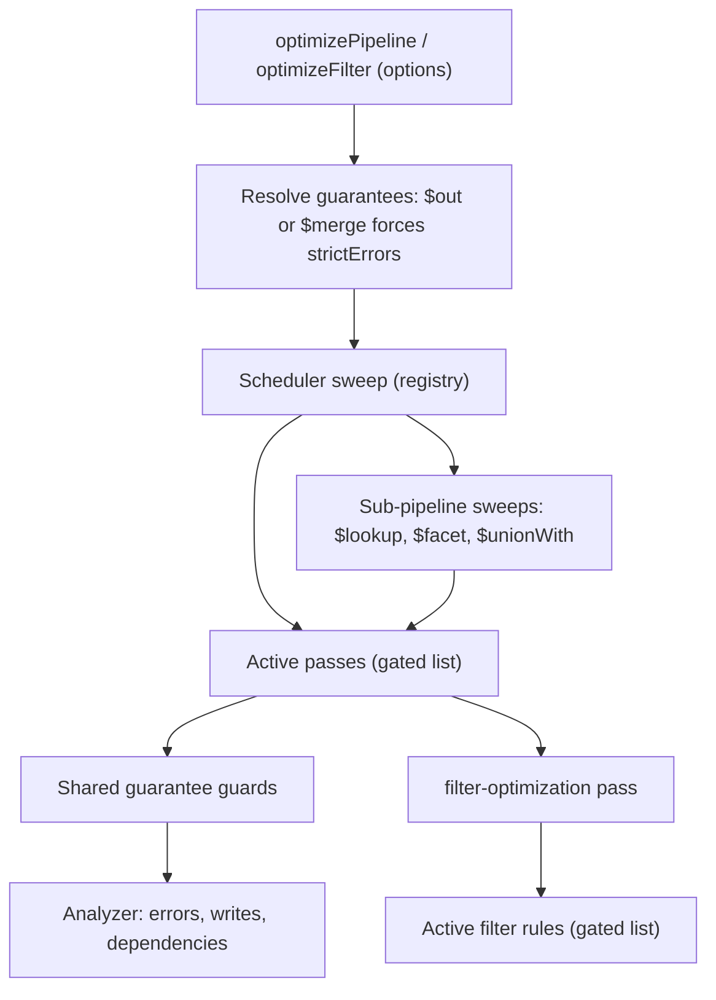
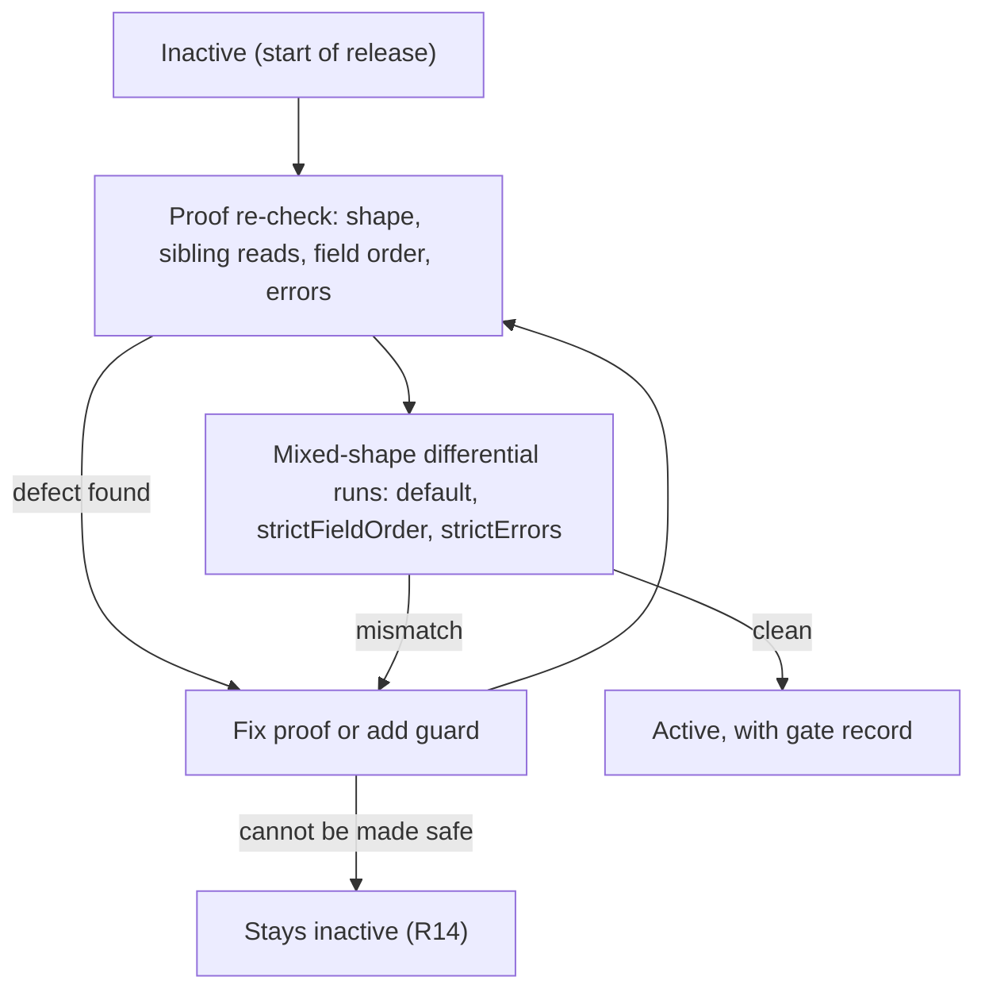

# Optimizer Correctness Hardening - Plan

## Goal Capsule

- **Objective:** The optimizer can be used in production projects with polymorphic data, and it never changes the result of a query that succeeds.
- **Means:** Every pass is turned off. Each pass is turned back on only after it passes a re-check of its proof and live differential runs on mixed-shape data (Key Decisions; KTD5). Two parameters tighten the field-order and error guarantees (KTD1).
- **Product authority:** radixxko. This plan owns correctness hardening only. Adoption ergonomics, codebase cleanup and new optimizations are not active scope.
- **Authority order:** Product Contract requirements win on behavior. Key Technical Decisions win on mechanism within those requirements. Implementation Units override neither.
- **Execution profile:** Deep, four phases, 13 units. Live MongoDB 8 through the existing oracle harness is required from U3 onward.
- **Stop conditions:**
  - Stop and ask when a session-settled decision proves infeasible.
  - Stop and ask when the oracle database is unreachable for more than one unit.
  - Stop and ask when a fix would need a weaker guarantee than R1–R8 state.
  - A pass that cannot meet the gate stays inactive per R14. That is not a stop condition.
- **Tail ownership:** `ce-work` executes through local verification. Shipping and the PR go through `ce-commit-push-pr`.
- **Product Contract preservation:** changed, no scope change. Requirements, Acceptance Examples and Key Decisions are unchanged. Summary gained one implementation-approach paragraph. Scope Boundaries gained a Deferred to Follow-Up Work subsection that restates KTD7 and R14. Outstanding Questions were resolved in place into KTD1, KTD3, KTD6, KTD7 and KTD14, and the remaining items are deferred to implementation.
- **Open blockers:** None.

---

## Product Contract

### Summary

Before the optimizer goes into real projects, every pass is turned off. A pass is turned back on only after its proof is re-checked and it matches MongoDB on live differential runs with mixed-shape documents, in default mode and in each strict mode. A small seeded random differential run is part of the release check. Two parameters let callers ask for the exact field order and identical error behavior. By default the optimizer picks the fastest safe rewrite.

The work builds the harness first: the two parameters, a mode-aware oracle comparison, a shared mixed-shape fixture catalog and the two real-world queries as tracked fixtures. Then the passes that `test.query` relies on are fixed and re-enabled, then the remaining passes and filter rules, then the docs. Filter rules go through the same gate as pipeline passes. The four contained passes stay contained.

### Problem Frame

A review before adoption found four ways the optimizer silently returns wrong results, plus two places where its behavior contradicts the documented contract. Each was reproduced against live MongoDB 8.

- `add-field-pushdown` splits a multi-field `$addFields` stage. The fields left behind then read the hoisted value instead of the input value.
- `unwind-prefilter` inserts an `$elemMatch` filter. That filter drops documents whose unwound field holds a scalar or an object, or an array of scalars when the predicate matches missing fields.
- `add-field-pushdown` changes the order of fields in output documents.
- `top-k-pushdown` turns a query that fails into one that succeeds.

The existing differential suite missed the wrong-result bugs. Its generated fixtures only ever store arrays of objects. The projects that will use the library have fields that are a number in some documents, `{ min, max }` in others, and arrays elsewhere. That is exactly the shape the suite never covered. A recent change also hid the field-order difference by appending a normalizing `$replaceWith` to four test pipelines. 100% branch coverage and a fully green suite therefore did not show the passes are correct.

### Key Decisions

- **Fastest rewrites by default; only successful results are guaranteed.** The user wants the fastest improvements unless they ask for more. Governs R2, R3. (session-settled: user-directed — chosen over strict-by-default with opt-in relaxation: default should be the fastest improvements, and results must match only when the original query has no errors)
- **Field order inside documents is relaxed by default and can be made strict with a parameter.** Apps that read the output as JSON don't notice field order, and relaxing it keeps the `test.query` hoist. Governs R2, R4. (session-settled: user-approved — chosen over identical order by default and over re-sorting fields with an extra stage: keeps the fast path, and strictness stays available)
- **Writes are always strict about errors.** If a write pipeline that should have failed succeeds instead, it writes data the original never would. Governs R6, R7. (session-settled: user-approved — chosen over relaxed errors everywhere and over refusing to optimize write pipelines: safety on writes without giving up read speed)
- **Every pass is turned off, then turned back on only after passing a gate. A small seeded random run is part of the release check.** Being "active" has to mean a pass was checked against mixed shapes. Governs R10, R11, R12, R13, R14, R18. (session-settled: user-approved — chosen over fixing only the known bugs with every pass left on, and over building a full random pipeline generator now: the tests showed blind spots beyond the four known bugs)
- **Shape safety is unconditional.** No mode lets callers assume that a field has a consistent type. The target projects store polymorphic fields, so an assumption like that would be wrong in practice. Governs R8.
- **Correctness comes before adoption ergonomics.** This plan was chosen as the first area, ahead of API ergonomics, cleanup and new optimizations. (session-settled: user-approved — chosen over API ergonomics first, cleanup first, and new optimizations first: nothing ships to projects until results can be trusted)

### Requirements

**Result guarantee**

- R1. When the original query succeeds, the optimized query returns the same documents with the same field names and values, in every mode. That means the same membership and multiplicity, and the same order wherever the original pipeline determines order.
- R2. By default, the order of fields inside each output document may differ from the original.
- R3. By default, when the original query fails, the optimized query may fail with a different error, fail at a different stage, or succeed.
- R4. When the caller enables the field-order parameter, every output document has the same field order as the original.
- R5. When the caller enables the error parameter, the optimized query fails exactly when the original fails.
- R6. Pipelines that contain `$out` or `$merge` always behave as though the error parameter is enabled, whatever the caller passes.
- R7. The user-facing docs tell callers to enable the error parameter for filters used in update and delete operations. The Mongoose example reflects this.
- R8. Every guarantee holds whatever shape a field has, and when the same field has different shapes across documents. Shapes in scope: scalar, object, array of scalars, array of objects, nested arrays, null and missing.
- R9. The documented constraints describe this result guarantee and its parameters. They replace the current wording that waives errors only for `$lookup`.

**Pass activation gate**

- R10. For this release, every pipeline pass starts out inactive.
- R11. A pass becomes active only after a proof re-check. The re-check covers field-shape assumptions, fields in the same stage that read each other, and dependence on field order or error behavior.
- R12. A pass becomes active only after live differential runs on the mixed-shape fixtures show zero mismatches, in default mode and with each strict parameter enabled.
- R13. If a pass is safe by default but violates a guarantee that a strict parameter protects, it stays active by default and is constrained or skipped while that parameter is enabled.
- R14. A pass that cannot meet the gate stays inactive. It does not block the release.
- R15. The passes that `test.query` relies on are re-checked first.

**Verification**

- R16. The mixed-shape fixtures include documents where the same field is a number, a `{ min, max }` object, an array of numbers, an array of objects, null and missing.
- R17. Default-mode comparisons ignore field order and accept any outcome when the original fails. Strict-mode comparisons check exact field order, or identical failure, according to the parameter enabled. The four pipelines masked with `$replaceWith` go back to their unmasked form.
- R18. The release check includes a seeded random differential run. It combines random mixed-shape documents with short pipelines built from the patterns the active passes rewrite. Any failure can be replayed from its seed.
- R19. `test.query` and `test.full.query` run as real-world pipelines against generated mixed-shape data, in every mode.

### Acceptance Examples

- AE1. Sibling field reads a hoisted field
  - **Covers R1, R8.**
  - **Given:** a `$lookup` followed by `$addFields { score: score + 5, oldScore: '$score' }`, `$sort` by `score`, and `$limit`.
  - **Then:** `oldScore` keeps the input value of `score`, in every mode.
- AE2. Hoisted field changes field order
  - **Covers R2, R4.**
  - **Given:** a computed sort key that could be hoisted above a `$lookup`.
  - **When** run in default mode, **then** the field may come before the lookup alias.
  - **When** the field-order parameter is enabled, **then** every document keeps the original field order.
- AE3. Unwound field is an object, not an array
  - **Covers R8.**
  - **Given:** one document with `items: { score: 5 }` and one with `items: [{ score: 5 }]`.
  - **When:** `$unwind '$items'` then `$match { 'items.score': 5 }` runs.
  - **Then:** both documents are returned, in every mode.
- AE4. Unwound array holds scalars and the predicate matches missing fields
  - **Covers R8.**
  - **Given:** `items: [1, 2]`.
  - **When:** `$unwind` then `$match { 'items.score': { $exists: false } }` runs, or the same with `'items.score': null`.
  - **Then:** one document per element is returned, in every mode.
- AE5. Original fails on a row that `$limit` would drop
  - **Covers R3, R5.**
  - **Given:** a `$toInt` over a value that fails conversion, followed by `$sort` and `$limit` that would exclude that row.
  - **When** run in default mode, **then** the optimized query may succeed.
  - **When** the error parameter is enabled, **then** the optimized query fails.
- AE6. Write pipeline with a failing stage
  - **Covers R6.**
  - **Given:** a pipeline ending in `$merge` with an upstream stage that fails on some row.
  - **When:** it runs with default settings.
  - **Then:** the optimized pipeline fails just as the original does.

### Success Criteria

- Under default settings, `test.query` keeps its current optimized shape. The exception is a step whose pass the gate shows to be unsafe. The current shape is `$match`, `$addFields` (furthestStage), `$sort`, `$limit`, both `$lookup` stages, then the remaining `$addFields`.
- Live differential runs show zero mismatches for every active pass, in every mode. The seeded random run is clean for the agreed seed set.
- The project owner can turn the optimizer on in a project with polymorphic data without auditing each query by hand.

### Scope Boundaries

- Turning individual passes on or off, explain/trace output, and a signal when the optimizer falls back to the original pipeline: all deferred to the adoption-ergonomics area.
- Codebase cleanup is deferred. That includes the copied path helpers, mixed import and format styles, and the re-export shim. The only doc changes in scope are those R7 and R9 require, plus examples that describe behavior the optimizer doesn't have.
- New optimizations are deferred.
- A full random generator for arbitrary pipelines is deferred. R18 covers only short pipelines built from the active passes' patterns.

#### Deferred to Follow-Up Work

- The four contained passes (`stage-priority-reorder`, `redundant-projection-elimination`, `covered-projection-synthesis`, `dead-assignment-elimination`) stay contained this release (KTD7). They can enter the gate in a later release.
- Passes that fail the gate stay inactive per R14. Fixing them is follow-up work, tracked by their gate records.

<!-- ce-section: work-relationships -->
### How This Work Fits Together

This plan owns correctness hardening. The breakdown below is the current understanding, not a committed roadmap.

- Adoption ergonomics: per-pass toggles, safety presets and explain/trace output.
  - Depends on this plan's parameter surface and result guarantee.
  - Still to decide: whether toggles live in the same options object as the R4 and R5 parameters.
- Codebase and docs cleanup: deduplication, style consistency, deciding the future of passes that are contained but never run.
  - Can proceed independently of this plan once the gate settles which passes stay.
- New optimizations
  - Depends on this plan's gate. New passes enter through the same gate as R11 and R12.

### Dependencies / Assumptions

- Live MongoDB 8 stays available for differential runs through the existing oracle harness.
- With the error parameter enabled, the optimized query fails exactly when the original does, per R5. It is assumed that the same error code is not required.
- The project owner has no corpus of production queries. `test.query` and `test.full.query` stand in for real-world pipelines.

### Outstanding Questions

**Resolved during planning**

- Parameter names and their place on both entry points: KTD1.
- Skip versus preserve under a strict parameter: the shared guards in KTD3 and KTD4 set the default. Each pass records its choice in its gate record (KTD5).
- Seed count and size of the random run: KTD14.
- Whether filter rewrites can change error behavior: some filter rules can drop clauses, so filter rules go through the gate and honor the error parameter (KTD6). R7 is therefore not documentation-only.
- Whether the contained passes enter the gate: no, see KTD7.

**Deferred to Implementation**

- The exact set of passes `test.query` relies on. U5 measures it. The expected set is `add-field-pushdown`, `top-k-pushdown` and `lookup-delay`, plus any filter rule that touches its `$match`.
- Whether MongoDB short-circuits `$or` branches when one branch matches everything. The answer decides whether `simplify-disjunction-identities` needs a strict-errors guard (U11).
- Whether server-side JavaScript (`$function`) is enabled on the oracle database. U5 checks this first; see Risks.

### Sources

- `src/passes/add-field-pushdown-proofs.ts`: the split logic never checks whether the remaining fields read the pushed ones (AE1).
- `src/passes/unwind-proofs.ts`: builds the `$elemMatch` prefilter without guarding against non-array shapes (AE3, AE4).
- `src/passes/top-k-proofs.ts`: lists `$addFields` and `$set` as passive stages without considering expressions that can fail (AE5).
- `src/passes/registry.ts`: existing active and contained pass lists, the basis for R10 through R14.
- `tests/fixtures/generated-interactions.ts`: generated documents only ever store arrays of objects.
- `tests/fixtures/semantic-cases.ts`: two of the four pipelines masked with `$replaceWith` (R17). The other two are generated in `tests/fixtures/generated-interactions.ts`.
- `tests/helpers/mongodb-oracle.ts`: current observation modes are ordered-bson, multiset, acceptance-error and structural-barrier.
- `CONSTRAINTS.md`: the error waiver that R9 supersedes.
- `USAGE.md`: the Mongoose example that applies the optimizer to update and delete operations (R7).

---

## Planning Contract

### Key Technical Decisions

- KTD1. **One options object on both entry points, with two boolean flags.** `optimizePipeline` and `optimizeFilter` each take an optional second argument with `strictFieldOrder` and `strictErrors`. Both default to `false`. The options type is exported from the package root. `optimizeFilter` accepts `strictFieldOrder` for symmetry and ignores it, because a filter produces no output documents. The change is additive, so existing callers keep their behavior. Governs R2–R5.
- KTD2. **Resolved guarantees travel as a context object through the scheduler.** The entry point resolves the options once. A top-level `$out` or `$merge` stage forces `strictErrors` on (R6). The scheduler in `src/passes/registry.ts` passes the same context to every pass and into every `$lookup`, `$facet` and `$unionWith` sub-pipeline sweep, because sub-pipeline output lands in the parent's documents. Filter rules receive the context through `filter-optimization` and through `optimizeFilter`.
- KTD3. **Strict-errors mode uses one shared conservative rule.** While `strictErrors` is on, a rewrite may not move a stage across another stage, remove a stage, or change which rows reach a stage, if either stage is not proven error-free. A stage is proven error-free when the analyzer reports `errors: 'none-known'` for the stage and its child pipelines (`src/analyzer/semantics.ts`). Consequence: in strict-errors mode `test.query` loses its sort/limit hoist, because its `$function` stage cannot be proven error-free. That is the R13 outcome. (session-settled: user-approved — chosen over per-pass bespoke error reasoning: one rule is auditable and the analyzer already tracks error possibility)
- KTD4. **Two more shared guards: a default-mode error guard and a strict-field-order guard.**
  - Default-mode error guard, active in every mode: a rewrite must never make a stage that is not proven error-free run on rows it would not have seen in the original. Otherwise a succeeding query could start to fail, which violates R1.
  - Strict-field-order guard, active while `strictFieldOrder` is on: a rewrite may not change the relative order in which stages add new fields, at the top level or inside embedded documents. That covers moving a field-adding stage (`$addFields`, `$set`, `$lookup`, `$unwind` with `includeArrayIndex`) across another one, and splitting a field-adding stage across one. Overwriting an existing field keeps its position, but the optimizer cannot prove a field exists on polymorphic data, so the guard treats every added field as new.
- KTD5. **The gate is an explicit active list plus test-enforced evidence.** The production active lists in `src/passes/registry.ts` and `src/filter-rule-registry.ts` start empty (R10). A pass or rule joins the list in its own commit. Each entry needs a gate record in `tests/fixtures/proof-manifest.ts` with three things:
  - a short proof re-check note covering shape, sibling reads, field order and errors (R11);
  - the IDs of its mixed-shape differential cases for default, strict-field-order and strict-errors mode (R12);
  - its strict-mode behavior: preserved, constrained or skipped (R13).

  `tests/registry-proof-manifest.test.ts` fails when an active entry lacks a complete record.
- KTD6. **Filter rules go through the same gate as pipeline passes.** `simplify-disjunction-identities` and `simplify-conjunction-identities` can drop a clause that would have errored. `optimizeFilter` is a public entry point, so R1 and R5 apply to it. (session-settled: user-approved — chosen over gating only pipeline passes: some filter rules can swallow errors in update and delete filters)
- KTD7. **The four contained passes stay contained this release.** They never ran in production, and putting them through the gate is new-optimization work. (session-settled: user-approved — chosen over gating them now: keeps the release focused on passes that already ship)
- KTD8. **Tests keep running the pre-gate pass set through a test helper.** Twenty-two unit test files call the public `optimizePipeline` or `optimizeFilter` to assert rewrites. A test helper exports functions with the same names, bound to a frozen copy of the pre-gate active lists through the existing package-private candidate seams. Each of those files swaps one import line. The suite stays green while production lists are empty, and pass mechanics keep their coverage. A guard test compares the frozen set with the production lists: the difference must equal the passes recorded as inactive.
- KTD9. **The oracle comparison policy is a second axis, next to row-order mode.** The existing `ordered-bson` and `multiset` modes keep deciding row order. A new policy derived from the options used to produce the optimized form adds two settings:
  - Field order: relaxed canonicalizes documents with recursively sorted object keys before fingerprinting; arrays keep their order. Strict keeps the current raw EJSON fingerprint.
  - Errors: relaxed accepts any optimized outcome when the original failed, and requires success when the original succeeded. Strict requires the same success or failure status. Error codes are not compared (Dependencies / Assumptions).
- KTD10. **Differential cases declare the outcome they expect from the original query.** Polymorphic data often makes the original fail, for example `$add` over a `{ min, max }` object. A case that expects success fails when the original errors. Without that check, a default-mode run would accept anything and prove nothing.
- KTD11. **One shared shape catalog feeds every mixed-shape fixture.** The catalog covers R8 and R16: number, `{ min, max }` object, plain object, array of numbers, array of objects, nested array, null and missing. Focused cases, generated interactions, the real-world data builders and the random run all draw from it.
- KTD12. **`unwind-prefilter` emits a shape-safe superset prefilter.** It does not use `$elemMatch`.
  - The prefilter holds the matching dotted-path predicates.
  - It is OR-ed with an escape branch that admits documents whose unwound array contains a nested array, because dotted paths do not reach through nested arrays.
  - Only predicates that cannot match missing or null fields qualify: equality to a non-null scalar, `$in` without null, range operators with non-null operands, and `$exists: true`. Any other predicate skips the pass.
  - The live oracle confirms the form across the shape catalog before the pass is re-enabled.

  (session-settled: user-approved — chosen over leaving the pass inactive: keeps the prefilter's index benefit with a provably wider filter)
- KTD13. **`add-field-pushdown` refuses unsafe splits and steps aside in strict-field-order mode.** The split is refused when any remaining field depends on a pushed key, or reads the whole document through `$$ROOT` or `$$CURRENT`. In strict-field-order mode the pass does nothing whenever a crossed stage adds fields, under the KTD4 field-order guard.
- KTD14. **The random differential run uses fixed seeds and a seed-replay switch.** It reuses `seededRandom` from `tests/fixtures/generated-interactions.ts`. CI runs a fixed seed list, starting with three seeds of 40 pipelines each. An environment variable replays one seed. Seed count is tuned during U12 so the integration suite takes at most about twice its current runtime.
- KTD15. **The real-world queries become tracked JSON fixtures with seeded data builders.** `test.query` and `test.full.query` are copied into `tests/fixtures/real-world/`. A data builder for each referenced collection seeds polymorphic variants for every field path the pipeline reads. The untracked root files and `scripts/optimize.ts` stay as they are. (session-settled: user-approved — chosen over loading the untracked root files at test time: tests must not depend on files missing from a fresh clone)

### High-Level Technical Design

**Guarantee flow.** The diagram shows how options become one context that every pass and guard reads.

**Mode matrix.** The table shows which guards each mode applies. Each gate record states how its pass behaves in each column.

| Guard (owner) | Default | `strictFieldOrder` | `strictErrors` (also forced by `$out`/`$merge`) |
|---|---|---|---|
| Never make a success fail: no new rows reach a stage that may error (KTD4) | on | on | on |
| No reorder, removal or row change around a stage that may error (KTD3) | off | off | on |
| No change in the order fields are added (KTD4) | off | on | off |
| Oracle field-order comparison (KTD9) | relaxed | strict | relaxed |
| Oracle error comparison (KTD9) | relaxed | relaxed | strict |

**Gate lifecycle per pass.** A pass moves through these states once per release.

### Per-Pass Audit Hypotheses

These are the starting risks for each proof re-check (R11). They are hypotheses. The re-check and the differential runs decide.

| Pass or rule | Shape risk | Sibling-read risk | Field-order risk | Error risk | Unit |
|---|---|---|---|---|---|
| `add-field-pushdown` | low | confirmed bug A | confirmed (B) | low | U7 |
| `top-k-pushdown` | sort over arrays uses min/max | none | none | confirmed (F) | U8 |
| `lookup-delay` | low | none | moves the `$lookup` alias | lookup sub-pipeline may error | U9 |
| `unwind-prefilter` | confirmed bugs C, D, E | none | none | low | U10 |
| `expr-match-normalization` | `$expr` equality versus query array traversal | none | none | drops an `$expr` that may error | U11 |
| `match-pushdown` | moving across `$unwind` | none | none | crosses stages that may error | U11 |
| `limit-advance` | low | none | none | crosses stages that may error | U11 |
| `group-filter-pushdown` | array and missing group keys | none | none | low | U11 |
| `bucket-filter-pushdown` | non-numeric boundary values | none | none | `$bucket` without default errors | U11 |
| `redundant-sort-elimination` | array sort keys | none | none | low | U11 |
| `sort-by-count-simplification` | tie order | none | none | low | U11 |
| `limit-skip-coalescing` | none | none | none | low | U11 |
| `unused-field-pruning` | low | none | inserted projection | removes computations that may error | U11 |
| `adjacent-project-merging` | low | second stage reads the first | low | low | U11 |
| `adjacent-add-field-merging` | low | second stage reads the first, like bug A | low | low | U11 |
| `redundant-lookup-elimination` | none | none | none | removes a lookup that may error | U11 |
| `sort-project-commute` | sort on computed fields | none | none | low | U11 |
| `complex-projection-deferral` | low | none | moves a projection | defers computations that may error | U11 |
| `facet-prefix-hoisting` | low | none | none | low | U11 |
| filter rules (8) | singleton `$in` with regex or array values | none | none | identity rules drop clauses | U11 |

### Risks & Dependencies

| Risk | Mitigation |
|---|---|
| The oracle database has server-side JavaScript disabled, so `test.query` always fails on its `$function` stage and default-mode runs prove nothing. | U5 checks this first. If `$function` is unavailable, the fixture adds a second variant with the `$function` stage replaced by an equivalent expression, and the original variant runs only as a strict-errors check. |
| The analyzer's error tracking is conservative, so strict-errors mode blocks most rewrites. | R13 accepts this. Gate records state the strict-mode behavior so callers know what they give up. |
| Emptying the active lists breaks a large part of the unit suite. | KTD8 helper swap lands in the same commit as the emptied lists (U6). |
| Mode matrix triples integration runtime. | Mixed-shape cases use small collections. KTD14 caps the random run. The real-world corpus runs with fixed small data sizes. |
| The real-world queries contain business-specific names once committed. | The user approved tracking them (KTD15). |
| Relaxed field-order comparison could hide a real difference. | It only relaxes key order inside output documents. Membership, values and row order are still compared, so equality filters on embedded documents still show up as membership changes. |

### System-Wide Impact

- **Public API:** both entry points gain an optional options argument and an exported options type. Existing call sites compile and behave the same, except that inactive passes no longer rewrite.
- **Downstream projects:** until a pass is re-enabled, the optimizer returns an equivalent but less optimized pipeline. The docs state this (U13).
- **Write paths:** pipelines with `$out` or `$merge` are always strict about errors (R6). Update and delete filters should pass `strictErrors` (R7).

---

## Implementation Units

### Unit Index

| U-ID | Title | Key files | Depends on |
|---|---|---|---|
| U1 | Guarantee options and context plumbing | `src/guarantees.ts`, `src/index.ts`, `src/passes/types.ts`, `src/passes/registry.ts`, `src/filter-optimizer.ts` | none |
| U2 | Shared guarantee guards | `src/passes/guarantee-guards.ts` | U1 |
| U3 | Mode-aware oracle comparison and unmasking | `tests/helpers/mongodb-oracle.ts`, `tests/fixtures/semantic-cases.ts`, `tests/fixtures/generated-interactions.ts` | U1 |
| U4 | Mixed-shape catalog and mode matrix | `tests/fixtures/mixed-shapes.ts`, `tests/mixed-shape-differential.integration.test.ts` | U3 |
| U5 | Real-world corpus | `tests/fixtures/real-world/`, `tests/real-world-differential.integration.test.ts` | U3, U4 |
| U6 | Gate mechanism and test helper swap | `src/passes/registry.ts`, `src/filter-rule-registry.ts`, `tests/fixtures/proof-manifest.ts`, `tests/helpers/pre-gate-optimizer.ts` | U1, U4 |
| U7 | Fix and re-enable `add-field-pushdown` | `src/passes/add-field-pushdown-proofs.ts` | U2, U6 |
| U8 | Mode-aware `top-k-pushdown` and re-enable | `src/passes/top-k-proofs.ts` | U2, U6 |
| U9 | Re-enable the rest of the `test.query` pass set | `src/passes/lookup-delay.ts`, `src/passes/registry.ts` | U5, U7, U8 |
| U10 | Shape-safe `unwind-prefilter` and re-enable | `src/passes/unwind-proofs.ts` | U2, U6 |
| U11 | Audit and re-enable remaining passes and filter rules | `src/passes/*-proofs.ts`, `src/filter-rule-registry.ts` | U2, U6 |
| U12 | Seeded random differential run | `tests/fixtures/random-pipelines.ts`, `tests/random-differential.integration.test.ts` | U4, U11 |
| U13 | Docs for the new guarantee | `CONSTRAINTS.md`, `USAGE.md`, `README.md`, `SUPPORT.md` | U11 |

### Phase 1: Harness

### U1. Guarantee options and context plumbing

- **Goal:** Callers can pass the two strict parameters, and every pass can read the resolved guarantees.
- **Requirements:** R4, R5, R6; KTD1, KTD2.
- **Dependencies:** none.
- **Files:**
  - Modify: `src/index.ts`, `src/passes/types.ts`, `src/passes/registry.ts`, `src/filter-optimizer.ts`, `src/filter-rule-registry.ts`, `src/passes/filter-optimization.ts`.
  - Create: `src/guarantees.ts` (options type, resolved context, write-stage detection).
  - Test: `tests/guarantee-options.test.ts`.
- **Approach:**
  1. Define the options type and a resolver that returns a frozen context. The resolver sets `strictErrors` when the top-level pipeline holds `$out` or `$merge`.
  2. Extend the pass interface so `execute` receives the context. Existing passes ignore it until their unit adds guards.
  3. Thread the context through `optimizePipelineWithPasses`, the sweep functions and `optimizeStageChildrenForSweep`, so sub-pipelines get the same context.
  4. Thread the context through `optimizeFilter`, the candidate seams and the filter rule runner.
- **Patterns to follow:** frozen registry objects in `src/passes/registry.ts`; radixxko format.
- **Test scenarios:**
  - `optimizePipeline` with no options and with `{}` returns the same pipeline as before the change, for an existing fixture.
  - A custom test pass records the context it receives: defaults are both `false`, and passed flags arrive unchanged.
  - Covers AE6. A pipeline ending in `$merge` delivers `strictErrors: true` to the test pass even when the caller passes `strictErrors: false`. The same holds for `$out`.
  - A `$merge` inside a `$lookup` sub-pipeline is not legal in MongoDB. The resolver only inspects the top level, and a test pins that behavior.
  - The test pass sees the same context inside `$lookup`, `$facet` and `$unionWith` sub-pipelines.
  - `optimizeFilter(filter, { strictFieldOrder: true })` behaves the same as without the flag.
  - Non-array input to `optimizePipeline` still returns the input unchanged.
- **Verification:** typecheck passes. Existing unit tests pass unchanged. The new test file covers every resolver branch.

### U2. Shared guarantee guards

- **Goal:** Passes ask one module whether a rewrite is allowed under the active guarantees.
- **Requirements:** R1, R3, R4, R5, R13; KTD3, KTD4.
- **Dependencies:** U1.
- **Files:**
  - Create: `src/passes/guarantee-guards.ts`.
  - Modify: `vitest.config.ts` (add the module to the 100% branch thresholds).
  - Test: `tests/guarantee-guards.test.ts`.
- **Approach:**
  1. Add a guard for "stage proven error-free", using `analyzeStage` errors and child pipeline observable errors.
  2. Add a guard for moving one stage across another under the context, covering KTD3 and the default-mode part of KTD4.
  3. Add a guard for removing or deferring a stage under the context.
  4. Add a guard for "stage adds fields" and for moving or splitting a field-adding stage under `strictFieldOrder`.
- **Patterns to follow:** `canTopKPushAcrossStage` in `src/passes/top-k-proofs.ts` for the shape of a crossing check.
- **Test scenarios:**
  - `$addFields` with `$toInt` is not proven error-free. `$addFields` with `$ifNull` over plain paths is.
  - `$lookup` with a sub-pipeline holding `$toInt` is not proven error-free.
  - Moving `$limit` across a `$toInt` stage is allowed in default mode and refused in strict-errors mode.
  - Moving a `$toInt` stage earlier across a `$match` is refused in every mode, because it would see new rows.
  - Removing a stage that may error is refused only in strict-errors mode.
  - Moving `$addFields { a }` across `$lookup { as: 'b' }` is refused under `strictFieldOrder` and allowed otherwise.
  - Moving `$sort` across `$lookup` is allowed under `strictFieldOrder`, because `$sort` adds no fields.
  - Malformed or unknown stages are treated as not proven error-free.
- **Verification:** 100% branch coverage on the new module.

### U3. Mode-aware oracle comparison and unmasking

- **Goal:** The live oracle judges each optimized form against the guarantee of the mode that produced it.
- **Requirements:** R17; KTD9, KTD10.
- **Dependencies:** U1.
- **Files:**
  - Modify: `tests/helpers/mongodb-oracle.ts`, `tests/mongodb-differential.integration.test.ts`, `tests/fixtures/semantic-cases.ts`, `tests/fixtures/generated-interactions.ts`.
  - Test: `tests/mongodb-oracle.test.ts`.
- **Approach:**
  1. Add the comparison policy (field order, errors) to the comparison input and the differential case, derived from options.
  2. Add recursive key-sorting canonicalization for relaxed field order.
  3. Replace the acceptance check with the relaxed and strict error rules. Strict compares status only.
  4. Add the expected-original-outcome field and fail a case whose original outcome differs.
  5. Remove the `$replaceWith` normalization from `feat-add-field-pushdown-focused` and `feat-add-field-pushdown-oracle` in `tests/fixtures/semantic-cases.ts`, and from the `add-field-pushdown` case in `tests/fixtures/generated-interactions.ts`. Remove the `_id` tie-break added with it only if the original sort is already total; otherwise keep it and note why.
  6. Re-express existing `acceptance-error` cases under the strict-errors policy.
- **Patterns to follow:** existing `compareObservations` and its unit tests.
- **Test scenarios:**
  - Relaxed field order: `{a:1,b:2}` equals `{b:2,a:1}`, and the same holds inside an embedded document.
  - Relaxed field order: `[1,2]` does not equal `[2,1]`.
  - Strict field order: `{a:1,b:2}` does not equal `{b:2,a:1}`.
  - Relaxed errors: original error with optimized success is equal.
  - Relaxed errors: original success with optimized error is not equal.
  - Strict errors: original error with optimized success is not equal. Two errors with different codes are equal.
  - A case that expects original success fails when the original errors, in every policy.
  - Multiset row order still sorts fingerprints after canonicalization.
- **Verification:** oracle unit tests pass. The integration suite runs the four unmasked pipelines. Any mismatch there is expected until U7 and is tracked, not masked.

### U4. Mixed-shape catalog and mode matrix

- **Goal:** Every active pass has live differential cases on polymorphic data in default, strict-field-order and strict-errors mode.
- **Requirements:** R8, R12, R16; KTD10, KTD11.
- **Dependencies:** U3.
- **Files:**
  - Create: `tests/fixtures/mixed-shapes.ts` (shape catalog and document builders), `tests/fixtures/mixed-shape-cases.ts` (focused cases per pass pattern), `tests/mixed-shape-differential.integration.test.ts`.
  - Modify: `tests/fixtures/generated-interactions.ts` (`makeDocuments` draws from the catalog).
  - Test: `tests/mixed-shapes.test.ts` (catalog unit tests).
- **Approach:**
  1. Build the catalog of KTD11 and a builder that spreads each shape over a configurable field across a small collection.
  2. Write focused cases for each pass pattern in the audit table, including AE1–AE5 as named cases. Each case declares its expected original outcome.
  3. Run every case through the three modes. Mode-specific expectations come from the case.
  4. Make generated interactions draw documents from the catalog. Keep the seed constant.
- **Execution note:** AE1, AE3 and AE4 cases should fail against the current pass code before U7 and U10. Record that as proof the cases detect the bugs.
- **Test scenarios:**
  - The catalog yields at least one document per shape for a given field, including missing.
  - The builder is deterministic for a fixed seed.
  - Covers AE1. The sibling-read case fails against the current `add-field-pushdown` and is marked as a known failure until U7.
  - Covers AE3. The object-unwind case fails against the current `unwind-prefilter` until U10.
  - Covers AE4. The scalar-array cases with `$exists: false` and `null` fail until U10.
  - Covers AE5. The `$toInt` case expects original failure, and expects optimized failure under strict errors.
  - A case that uses `$add` on a polymorphic field declares original failure. A shape-tolerant variant declares success.
- **Verification:** the catalog unit tests pass. The integration file runs and reports known failures only for AE1, AE3 and AE4 cases.

### U5. Real-world corpus

- **Goal:** `test.query` and `test.full.query` run as live differential cases in every mode, and the set of passes they rely on is known.
- **Requirements:** R15, R19; KTD15.
- **Dependencies:** U3, U4.
- **Files:**
  - Create: `tests/fixtures/real-world/test-query.json`, `tests/fixtures/real-world/test-full-query.json`, `tests/fixtures/real-world/data.ts`, `tests/real-world-differential.integration.test.ts`, `tests/real-world-dependencies.test.ts`.
- **Approach:**
  1. Check whether `$function` runs on the oracle database. Apply the Risks mitigation if not.
  2. Copy both queries as JSON.
  3. Write seeded builders for every referenced collection. Cover each field path the pipelines read with the catalog shapes. Keep a majority of documents in shapes where the original succeeds.
  4. Run each query in the three modes, expecting original success for the main variant.
  5. Add a unit test that removes one pre-gate pass at a time and records which removals change the optimized `test.query`. That list is the R15 set.
- **Test scenarios:**
  - Both queries parse and match the root scratch files at the time of copying.
  - The data builder is deterministic for a fixed seed and covers every shape for `employment.salary`.
  - The original `test.query` succeeds on the generated data.
  - Under the pre-gate profile, the optimized `test.query` has the success-criterion shape.
  - The dependency test lists the passes whose removal changes that shape.
- **Verification:** the integration file runs in all three modes. The dependency list is recorded in the gate records for U7–U9.

### U6. Gate mechanism and test helper swap

- **Goal:** Every pass and filter rule is inactive in production, and the suite stays green.
- **Requirements:** R10, R11, R12, R13, R14; KTD5, KTD6, KTD7, KTD8.
- **Dependencies:** U1, U4.
- **Files:**
  - Modify: `src/passes/registry.ts`, `src/filter-rule-registry.ts`, `tests/fixtures/proof-manifest.ts`, `tests/registry-proof-manifest.test.ts`, `tests/containment.test.ts`, `tests/mongodb-differential.integration.test.ts`.
  - Modify (one import line each): the unit test files that call the public `optimizePipeline` or `optimizeFilter`, for example `tests/optimizer.test.ts`, `tests/e2e-complex-queries.test.ts` and `tests/lookup-passes.test.ts`.
  - Create: `tests/helpers/pre-gate-optimizer.ts`, `tests/gate-status.test.ts`.
- **Approach:**
  1. Freeze the current active lists into the test helper and bind it to the candidate seams with options support.
  2. Swap the imports in the affected unit test files.
  3. Empty both production active lists.
  4. Add gate record fields to the proof manifest and make the manifest test require a complete record for every active entry.
  5. Point the production differential cases at the helper profile so their live coverage of pass mechanics continues.
  6. Add the guard test: frozen set minus production set equals the passes recorded as inactive.
- **Execution note:** steps 1–3 land in one commit so the suite never goes red.
- **Test scenarios:**
  - With empty production lists, `optimizePipeline` returns a deep clone equal to its input.
  - With empty production lists, `optimizeFilter` returns a clone equal to its input.
  - The manifest test fails for an active pass with no gate record, and for one missing a strict-mode case.
  - Contained passes are neither active nor in the frozen set.
  - The guard test fails when a pass is active but not recorded, or recorded inactive but active.
- **Verification:** the unit suite is green with empty production lists. Coverage thresholds hold.

### Phase 2: The passes test.query relies on

### U7. Fix and re-enable `add-field-pushdown`

- **Goal:** The pass never changes field values, steps aside under strict field order, and is active.
- **Requirements:** R1, R2, R4, R11–R13, R15; KTD13.
- **Dependencies:** U2, U6.
- **Files:**
  - Modify: `src/passes/add-field-pushdown-proofs.ts`, `src/passes/add-field-pushdown.ts`, `src/passes/registry.ts`, `tests/fixtures/proof-manifest.ts`, `tests/fixtures/mixed-shape-cases.ts`.
  - Test: `tests/add-field-pushdown.test.ts`.
- **Approach:**
  1. Refuse a split when any remaining field depends on a pushed key or reads the whole document.
  2. Consult the field-order guard for every crossed stage.
  3. Consult the default-mode error guard for the pushed expressions.
  4. Re-check the proof for shape assumptions, write the gate record, then add the pass to the active list.
- **Test scenarios:**
  - Covers AE1. `{ score: score + 5, oldScore: '$score' }` after `$lookup` is not split. Live: `oldScore` equals the input `score` in every mode.
  - A remaining field that reads an unrelated field still allows the split.
  - A remaining field using `$$ROOT` blocks the split.
  - Covers AE2. Default mode hoists the sort key above `$lookup`. Under `strictFieldOrder` the pipeline is unchanged and the live field order matches.
  - Polymorphic `score` (number, object, array, missing): live default and strict-errors results match on success cases.
- **Verification:** the unmasked U3 cases pass. Gate record complete. Unit and integration suites green.

### U8. Mode-aware `top-k-pushdown` and re-enable

- **Goal:** Top-k pushdown keeps its default-mode speedup and respects strict errors.
- **Requirements:** R3, R5, R11–R13, R15; KTD3.
- **Dependencies:** U2, U6.
- **Files:**
  - Modify: `src/passes/top-k-proofs.ts`, `src/passes/top-k-pushdown.ts`, `src/passes/registry.ts`, `tests/fixtures/proof-manifest.ts`, `tests/fixtures/mixed-shape-cases.ts`.
  - Test: `tests/top-k-pushdown.test.ts`.
- **Approach:**
  1. Route each crossing through the shared guard.
  2. Re-check sort semantics over array sort keys and mixed BSON types.
  3. Write the gate record and activate.
- **Test scenarios:**
  - Covers AE5. Default mode moves `$sort`/`$limit` above a `$toInt` stage. Live: optimized may succeed while the original fails.
  - Covers AE5. Under `strictErrors` the pipeline is unchanged and both fail live.
  - Covers AE6. A `$merge` pipeline with the same shape is unchanged with default options.
  - A sort key holding arrays in some documents and scalars in others: live results match with a total sort order.
  - Ties at the limit boundary: cases use a total sort order, because the original membership is not determined otherwise.
- **Verification:** gate record complete. Suites green.

### U9. Re-enable the rest of the `test.query` pass set

- **Goal:** `test.query` gets its success-criterion shape from the production profile.
- **Requirements:** R15, R19; Success Criteria.
- **Dependencies:** U5, U7, U8.
- **Files:**
  - Modify: `src/passes/lookup-delay.ts` (and its proofs in `src/passes/movement-proofs.ts`), `src/passes/registry.ts`, `src/filter-rule-registry.ts`, `tests/fixtures/proof-manifest.ts`.
  - Test: `tests/lookup-passes.test.ts`, `tests/real-world-dependencies.test.ts`.
- **Approach:**
  1. Apply the field-order guard to `lookup-delay`, because moving a `$lookup` moves its alias.
  2. Apply the error guards, because a lookup sub-pipeline may error.
  3. Re-check and activate every other pass or rule in the U5 dependency list.
  4. Assert the production shape of `test.query` in default mode.
- **Test scenarios:**
  - Default mode: production `test.query` has the success-criterion shape.
  - `strictFieldOrder`: `$lookup` stages keep their position relative to `$addFields`. Live field order matches.
  - `strictErrors`: the sort/limit hoist does not cross the `$function` stage (KTD3). Live outcome status matches.
  - `test.full.query` in all three modes matches live.
- **Verification:** gate records complete for the whole dependency set. `npm run optimize` reproduces the expected shape in `test.optimized.query`.

### Phase 3: Remaining passes

### U10. Shape-safe `unwind-prefilter` and re-enable

- **Goal:** The prefilter never drops a document that the original `$unwind` and `$match` would keep.
- **Requirements:** R1, R8, R11, R12; KTD12.
- **Dependencies:** U2, U6.
- **Files:**
  - Modify: `src/passes/unwind-proofs.ts`, `src/passes/unwind-prefilter.ts`, `src/passes/registry.ts`, `tests/fixtures/proof-manifest.ts`, `tests/fixtures/mixed-shape-cases.ts`.
  - Test: `tests/unwind-prefilter.test.ts`.
- **Approach:**
  1. Replace the `$elemMatch` construction with the KTD12 superset form.
  2. Replace the unsupported-value check with the KTD12 qualifying-predicate list.
  3. Run the form against every catalog shape live before activation.
- **Test scenarios:**
  - Covers AE3. `items: { score: 5 }` and `items: [{ score: 5 }]` both survive. Live: two documents in every mode.
  - Covers AE4. `$exists: false` and `null` predicates skip the pass. Live: one document per element.
  - A nested array `items: [[{ score: 5 }]]` survives through the escape branch.
  - An array of scalars with a positive predicate: prefilter and original both return nothing.
  - Two predicates on different subfields produce two dotted predicates. Live results match.
  - `$in` containing null skips the pass.
  - `preserveNullAndEmptyArrays` still skips the pass.
- **Verification:** AE3 and AE4 cases from U4 pass. Gate record complete.

### U11. Audit and re-enable remaining passes and filter rules

- **Goal:** Every remaining pass and filter rule is either active with a gate record or recorded as inactive.
- **Requirements:** R11–R14; KTD3–KTD6.
- **Dependencies:** U2, U6.
- **Files:**
  - Modify: the proof file and pass file for each row of the audit table marked U11 (`src/passes/*-proofs.ts`, `src/passes/*.ts`), `src/filter-rule-registry.ts`, `src/passes/registry.ts`, `tests/fixtures/proof-manifest.ts`, `tests/fixtures/mixed-shape-cases.ts`.
  - Test: each pass's existing test file, for example `tests/group-filter-pushdown.test.ts`, `tests/expr-match-normalization.test.ts`, `tests/filter-optimizer.test.ts`.
- **Approach:**
  1. Work one pass or rule per commit, in audit-table order.
  2. For each: re-check against its hypotheses, add the shared guards, add mixed-shape cases for the three modes, then activate or record as inactive.
  3. For identity filter rules, settle the `$or` short-circuit question live before deciding on a strict-errors guard.
- **Test scenarios:**
  - `expr-match-normalization`: `$expr: { $eq: ['$tags', 'x'] }` over a field that is an array in some documents is not normalized to a query that matches array elements. Live results match.
  - `group-filter-pushdown`: a group key that is an array, null or missing across documents. Live results match.
  - `adjacent-add-field-merging`: a second stage reading a field the first stage writes is not merged unsafely. Live values match.
  - `unused-field-pruning` and `redundant-lookup-elimination`: under `strictErrors`, a computation or lookup that may error is not removed. Live statuses match.
  - `match-pushdown` and `limit-advance`: under `strictErrors`, no crossing of a stage that may error.
  - `simplify-disjunction-identities`: `{ $or: [{}, { $expr: { $toInt: '$x' } }] }` behaves per the live short-circuit finding under `strictErrors`.
  - `simplify-singleton-in`: `$in` with a single regex, array or object value. Live results match.
- **Verification:** the guard test from U6 passes. Every active entry has a complete gate record. Inactive entries list the blocking finding.

### U12. Seeded random differential run

- **Goal:** The release check includes a replayable random run over the patterns of active passes.
- **Requirements:** R18; KTD14.
- **Dependencies:** U4, U11.
- **Files:**
  - Create: `tests/fixtures/random-pipelines.ts`, `tests/random-differential.integration.test.ts`.
  - Test: `tests/random-pipelines.test.ts`.
- **Approach:**
  1. Build short pipelines (two to five stages) from templates for each active pass's rewrite pattern.
  2. Draw documents from the catalog with the same seed.
  3. Run each pipeline in all three modes and also with both strict flags.
  4. Print the seed and case index on any mismatch. Read a replay seed from an environment variable.
  5. Fail when a template never produced a successful original across the seed set.
- **Test scenarios:**
  - The same seed produces identical pipelines and documents.
  - Every active pass has at least one template.
  - A deliberately broken test pass is detected by the run (mutation check).
  - The replay variable runs exactly one seed.
- **Verification:** the run is clean for the fixed seed list, within the KTD14 runtime budget.

### Phase 4: Docs

### U13. Docs for the new guarantee

- **Goal:** Users can read the result guarantee, the parameters and the write-path advice.
- **Requirements:** R7, R9; Scope Boundaries (examples that describe missing behavior).
- **Dependencies:** U11.
- **Files:**
  - Modify: `CONSTRAINTS.md`, `USAGE.md`, `README.md`, `SUPPORT.md`.
- **Approach:**
  1. Rewrite `CONSTRAINTS.md` around R1–R8, replacing the lookup-only error waiver.
  2. Document both parameters on both entry points, and the automatic strict errors for `$out`/`$merge`.
  3. Change the Mongoose example in `USAGE.md` to pass `strictErrors` for update and delete filters.
  4. Fix or remove USAGE Pattern B, because the `tags: 'featured'` prefilter does not happen.
  5. List the active and inactive passes from the gate records in `SUPPORT.md`.
- **Test expectation:** none -- documentation only. U6's guard test keeps the pass list honest.
- **Verification:** every code example in the changed docs runs against the built package.

---

## Verification Contract

| Gate | Command | Applies to | Pass signal |
|---|---|---|---|
| Types | `npm run typecheck` | every unit | no errors |
| Unit suite | `npm test` | every unit | all green |
| Coverage | `npm run test:coverage` | U1, U2, U6–U11 | 100% branches on every threshold module, including `src/passes/guarantee-guards.ts` |
| Live differential | `npm run test:integration` | U3–U12 | zero unexpected mismatches in every mode; known failures only before their fixing unit |
| Real-world shape | `npm run optimize` | U9 | `test.optimized.query` has the success-criterion shape |
| Build | `npm run build` | U1, U13 | package builds with zero runtime dependencies |
| Release check | `npm run test:integration` including the random run | U12 and release | clean for the fixed seed list |

---

## Definition of Done

- Every pass and filter rule in production is active only with a complete gate record (R10–R14).
- Live differential runs show zero mismatches in default, strict-field-order and strict-errors mode for every active entry (R12).
- The four `$replaceWith` maskings are gone and their pipelines pass unmasked (R17).
- `test.query` and `test.full.query` pass in every mode, and `test.query` has the success-criterion shape in default mode (R15, R19).
- The random run is clean for the fixed seed list and replays by seed (R18).
- `CONSTRAINTS.md`, `USAGE.md`, `README.md` and `SUPPORT.md` describe the new guarantee, parameters and write-path advice (R7, R9).
- Coverage thresholds hold. The package has zero runtime dependencies. Code follows the radixxko format.
- No dead-end or experimental code from abandoned approaches remains in the diff. Throwaway probe tests are deleted.
- Per unit: the unit's Verification line holds, and its gate record (where it has one) is complete.
