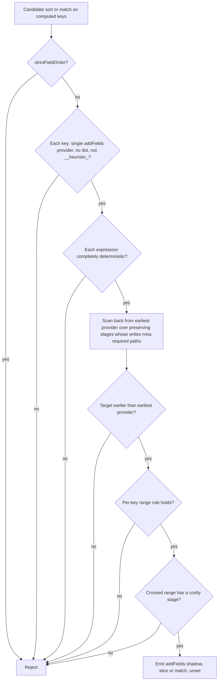

# Heuristic Pushdown Hardening and Extensions - Plan

## Goal Capsule

- **Objective:** Pipelines optimized by the package return the same results as the original pipeline on MongoDB 8. Pipelines that filter or take a Top-K slice on a computed field after expensive joins run those joins on fewer documents.
- **Means:** Harden the shadow-field technique that heuristic Top-K pushdown uses (KTD1–KTD5), extend it to `$match` (KTD8), and add a narrow constant-condition fold (KTD9).
- **Product authority:** radixxko.
- **Authority order:** Product Contract requirements win on behavior. Key Technical Decisions win on mechanism within those requirements. Implementation Units override neither.
- **Execution profile:** Standard, six units. Live MongoDB 8 through the existing oracle harness is required from U2 onward.
- **Stop conditions:**
  - Stop and ask when a session-settled decision proves infeasible.
  - Stop and ask when the oracle shows a MongoDB behavior that contradicts KTD9's truthiness assumptions.
  - Stop and ask when making the mock engine strict (KTD6) breaks more than a handful of unrelated test files.
- **Tail ownership:** `ce-work` executes through local verification. Shipping goes through `ce-commit-push-pr`.
- **Product Contract preservation:** new plan, no upstream contract.
- **Open blockers:** None.

---

## Product Contract

### Summary

Fix the correctness bugs found in heuristic Top-K pushdown, then make the test harness strict enough to catch the same class of bug. Then add three improvements: the same shadow-field trick for `$match` on computed fields, acceptance of deterministic `$function` calls nested inside other expressions, and folding of always-true conditions. Every bug case and every new rewrite runs in the live MongoDB 8 differential suite.

### Problem Frame

Heuristic Top-K pushdown landed in the last change. It computes a sort key early under a temporary `__heuristic_<name>` field, slices, then unsets the field before the first `$lookup` or `$$ROOT` reader. A review after landing found real gaps:

- When two sort keys come from different stages, stages between those providers are never checked. A probe showed the optimized pipeline returning ids `[1, 2]` where the original returned `[4, 2]`.
- A sort key that reads another computed sort key is evaluated before that key exists, so it becomes `null`.
- Dotted sort keys such as `arr.v` behave differently from a plain shadow value when `arr` is an array, an empty array, or a scalar.
- The `$function` determinism check is a denylist that misses `ObjectId()`, `UUID()`, `globalThis` state and `Math['random']`.
- The heuristic fires even when it only crosses cheap stages, which adds four stages for no gain.

The mock engine hid one of these bugs. It treats missing values in `$add` as `0` instead of returning `null`, and it crashes on dotted writes over scalars. The random differential suites lean on that engine, so they can pass while MongoDB disagrees.

The same blocking pattern also stops `$match` filters on computed fields. A filter on a computed count cannot move above a `$lookup` that is followed by a `$$ROOT` reader, so every join runs on documents the filter would drop.

### Key Decisions

- **Shadow pushdown applies only to completely deterministic expressions.** The early value must equal the value the original pipeline computes later. Governs R4, R5, R8. (session-settled: user-directed — chosen over allowing any expression: non-deterministic values such as `$rand` or current-time code would differ between the two evaluations.)
- **`$function` expressions stay accepted automatically, checked by a stricter blocklist.** Governs R4. (session-settled: user-approved — chosen over an opt-in flag: an opt-in would stop the real-world `furthestStage` query from optimizing by default.)
- **Index suggestions are out of this plan.** They add a new public output to the API. (session-settled: user-approved — chosen over including them now: the API surface needs its own design.)

### Requirements

**Heuristic Top-K correctness**

- R1. Heuristic Top-K pushdown never changes results when sort keys come from different stages, when one sort key reads another, or when a stage between providers writes a field a later provider reads.
- R2. Dotted computed sort keys are never hoisted by a shadow rewrite.
- R3. A shadow rewrite fires only when the hoist crosses at least one costly stage, and it never re-hoists its own `__heuristic_` fields.

**Determinism**

- R4. The `$function` determinism check rejects the extended set of non-deterministic APIs and any `lang` other than `js`. The docs state that this check is best-effort.
- R5. A deterministic `$function` nested inside another expression is accepted for shadow rewrites.

**Test fidelity**

- R6. The mock engine matches MongoDB for arithmetic on missing or `null` values, `$size` on non-arrays, dotted writes, and `$filter`. It throws on expression operators it does not implement.
- R7. Each bug case from R1–R2 and each new rewrite from R8–R9 runs in the live MongoDB 8 differential suite in default, `strictFieldOrder` and `strictErrors` modes.

**Improvements**

- R8. `$match` conjuncts on deterministic computed fields that are blocked by a barrier are evaluated early through a shadow field that is unset before the barrier. MongoDB query semantics on arrays and mixed types stay exact.
- R9. A `$size` over a `$filter` whose condition is always true folds to `$size` of the input, and an `$and` or `$or` whose operands are all truthy constants folds to `true`.

**Docs**

- R10. `CONSTRAINTS.md` describes the hardened shadow rules, the `$match` variant and the folding rules. `README.md` and `SUPPORT.md` list the new passes.

### Acceptance Examples

- AE1. Covers R1.
  - **Given:** `$addFields {k1: 0}`, `$set {base: -1}`, `$addFields {k2: size(tags) * base}`, `$sort {k1, k2, _id}`, `$limit 2`, with a `$lookup` before the first stage.
  - **When:** the pipeline is optimized.
  - **Then:** either no shadow rewrite fires, or the live result equals the original `[4, 2]`.
- AE2. Covers R1. `$addFields {k1: 0}` then `$addFields {k2: k1 - 1}` with `$sort {k1, k2}` behind a `$lookup` does not produce a shadow `k2` that reads the missing `$k1`.
- AE3. Covers R2. `$addFields {'arr.v': size(tags)}` then `$sort {'arr.v': 1}` behind a `$lookup` is left unchanged.
- AE4. Covers R3. A heuristic candidate whose only crossed stage is `$addFields {unrelated: 1}` is left unchanged.
- AE5. Covers R8.
  - **Given:** `$lookup`, `$addFields {rag: $function($$ROOT)}`, `$addFields {cnt: size(filter(engagements))}`, `$match {cnt: {$gt: 0}}`.
  - **When:** the pipeline is optimized.
  - **Then:** a shadow `cnt` and the rewritten `$match` run before the `$lookup`, the shadow field is unset before the `$lookup`, and the original `$match` is removed.
- AE6. Covers R9. `{$size: {$filter: {input: '$a', as: 'x', cond: {$and: [{}, {}]}}}}` becomes `{$size: '$a'}`. The same shape with a `limit` field is left unchanged.

### Success Criteria

- `test.full.query` still gets the heuristic Top-K rewrite in default mode, and its `$size`/`$filter` count with an always-true condition is folded.
- The live suite shows zero mismatches across all three modes for every new and changed case.

### Scope Boundaries

- Changes to the user's application query are out of scope. That covers the alphabetical `furthestStage` sort and rewriting `$function` as native MQL.
- Rewriting `$match` on computed fields into `$expr` is out of scope (KTD8).
- Hoisting dotted computed keys with array-aware logic is out of scope (KTD3).
- General constant folding beyond the R9 rules is out of scope.

#### Deferred to Follow-Up Work

- Index suggestions for `$lookup` foreign fields and sub-pipeline sorts.

### Sources

- `src/passes/top-k-proofs.ts` — `proveHeuristicTopKPushdown`, `isExpressionCompletelyDeterministic`, `collectExpressionDependencies`.
- `src/passes/top-k-pushdown.ts` — rewrite emission.
- `src/passes/movement-proofs.ts` — `proveMatchPushdownAcrossStage`, `rewriteQueryDocument` alias rewriting, `proveDisjointMatchPushdown` conjunct splitting.
- `src/analyzer/expressions.ts` — `analyzeUserCode` marks every `$function` as `volatile`.
- `tests/helpers/mock-engine.ts` — `evalExpr`, `setNestedVal`.
- `tests/fixtures/semantic-cases.ts`, `tests/fixtures/mixed-shape-cases.ts`, `tests/fixtures/proof-manifest.ts` — the pass gate evidence.
- `CONSTRAINTS.md` Section 9.

---

## Planning Contract

### Key Technical Decisions

- KTD1. **Shared shadow module.** Move the shadow machinery out of `top-k-proofs.ts` into a new `src/passes/shadow-proofs.ts`: determinism check, dependency collection, provider resolution, range validation, profitability gate and collision-free naming. Top-K and the `$match` variant both use it. `top-k-proofs.ts` re-exports the two public helpers so current imports keep working.
- KTD2. **Per-key range rule.** For every computed sort key, no stage in `[targetIndex, providerIndex)` may write, modify or remove any path the key's expression reads. This one rule covers both cross-provider bugs: a key that reads another computed key fails it, because that key's provider is inside the range. A violation rejects the rewrite instead of shrinking the target.
- KTD3. **Reject dotted computed keys.** A computed key containing `.` is not eligible. (session-settled: user-approved — chosen over array-aware support: the gain is rare and the array, empty-array and scalar semantics are easy to get wrong.)
- KTD4. **Profitability gate.** A shadow rewrite fires only when the crossed range contains a `$lookup`, a `$graphLookup`, or a stage whose expressions contain `$function` or `$accumulator`. Sort and filter keys that start with `__heuristic_` are never eligible. That stops a rewrite from nesting on its own output.
- KTD5. **Determinism check by substitution.** Before analysis, replace every `$function` node with an array of its `args`, after checking its body and `lang`. Then run the normal analyzer on the result. Arguments keep their variable scope, so `$$this` inside `$map` resolves correctly. Dependencies come from the same substituted tree. The body blocklist adds `ObjectId`, `UUID`, `globalThis`, `this`, bracket access on `Math`, `eval`, `Function` and timers to the current tokens. Under `strictErrors`, any `$function` still rejects the expression, as it does today, because user code can throw and substitution would hide that.
- KTD6. **Strict mock engine.** The mock engine throws on expression operators it does not implement. It also follows MongoDB on arithmetic over missing or `null` (the result is `null`), on `$size` of non-arrays (throws), and on dotted writes over arrays and scalars. It gains `$filter`. Tests that relied on the lax behavior either get the operator implemented or move to the oracle.
- KTD7. **Temporary field naming.** Shadow fields are named `__heuristic_<sanitized name>`, with a numeric suffix on collision. (session-settled: user-directed — chosen over `__opt_heuristic_<name>` and random names: short and readable in emitted pipelines.)
- KTD8. **`$match` uses a shadow field, not `$expr`.** Insert `$addFields {__heuristic_k: expr}`, then the rewritten `$match`, then `$unset`, at the target index. Paths are renamed through the existing `rewriteQueryDocument` alias map. Pushed conjuncts are removed from the original `$match`, and the original stage is deleted when it becomes empty. (session-settled: user-approved — chosen over `$expr` inlining: query operators and `$expr` compare arrays and mixed types differently.)
- KTD9. **Constant-fold rules.** A constant is truthy when it is `true`, a non-zero number, a string that does not start with `$`, `{}`, or a `$literal` of one of these. Fold array-form `$and`/`$or` when the array has at least one operand and every operand is a truthy constant. An empty `$or` evaluates to `false`, so it is never folded. Fold `$size` over `$filter` only when `cond` is a truthy constant or folds to `true` and no `limit` is present. Both sides already throw on `null`, missing and non-array input, so the fold is skipped under `strictErrors` only, where error codes could differ. Apply the rules to expression values in `$addFields`, `$set` and computed `$project` fields, and never inside `$literal`.
- KTD10. **Recompute after unset.** A shadow rewrite leaves the original provider stage in place, so the real field is recomputed on the surviving documents. (session-settled: user-directed — chosen over renaming the shadow field back after the barrier: the shadow field would then be visible to `$$ROOT` readers.)
- KTD11. **Pass placement.** The `$match` variant is a new pass `heuristic-match-pushdown`, registered right after `match-pushdown` so ordinary pushdown gets the first chance. Constant folding is a new pass `expression-simplification`, registered before `match-pushdown`. Both are active, with full gate records.

### High-Level Technical Design

Shadow proof gates, shared by Top-K and `$match` (KTD1):



Rewrite shape for the `$match` variant (KTD8). This sketch shows direction, not exact code:

```text
before:  match · lookup · addFields{rag: fn($$ROOT)} · addFields{cnt: E} · match{cnt > 0, other}
after:   match · addFields{__heuristic_cnt: E} · match{__heuristic_cnt > 0} · unset __heuristic_cnt
         · lookup · addFields{rag} · addFields{cnt: E} · match{other}
```

### Risks & Dependencies

| Risk | Mitigation |
|---|---|
| KTD6 strictness breaks many existing mock-based tests. | U1 starts by characterizing the breakage. If it spreads past a handful of files, stop per the Goal Capsule. |
| MongoDB treats `{}` or a non-boolean `$filter` condition differently than KTD9 assumes. | U5 adds oracle cases for each truthy constant before the fold ships. |
| New passes loop with `add-field-pushdown` or `adjacent-add-field-merging`. | KTD4's `__heuristic_` guard, plus an interaction case through the full registry that checks a fixed point. |
| The profitability gate changes expected output in current tests. | Current heuristic tests cross a `$lookup`. Update any expectation that only crossed cheap stages. |
| `$jsonSchema` or `$where` conjuncts see the shadow field. | U4 pushes only conjuncts whose analysis is safe and that read no whole-document dependency. |

### System-Wide Impact

- Default-mode output of `optimizePipeline` changes for pipelines that hit the new rewrites. That includes `test.full.query`.
- The proof manifest, gate status, registry tests and coverage thresholds all gain two new pass IDs.

---

## Implementation Units

### U1. Mock engine fidelity

- **Goal:** The mock engine fails or disagrees where MongoDB would, instead of hiding differences.
- **Requirements:** R6.
- **Dependencies:** none.
- **Files:** `tests/helpers/mock-engine.ts`, `tests/mock-engine.test.ts`, plus any test that relied on lax behavior.
- **Approach:**
  1. Run the unit suite with an unknown-operator throw to list the affected tests.
  2. Implement the KTD6 behaviors and add `$filter` with `as` and `cond`.
  3. Fix or reroute the affected tests.
- **Execution note:** Characterize the breakage before changing behavior.
- **Patterns to follow:** existing operator branches in `evalExpr`.
- **Test scenarios:**
  - `$add` with one missing operand returns `null`.
  - `$multiply` with a `null` operand returns `null`.
  - `$size` of a missing field throws.
  - `$addFields {'arr.v': 5}` over `arr: [{}, {}]` sets `v` on each element.
  - `$addFields {'arr.v': 5}` over `arr: []` leaves `[]`.
  - `$addFields {'arr.v': 5}` over a scalar `arr` follows MongoDB, or throws an explicit unsupported error instead of a `TypeError`.
  - `$filter` keeps elements whose `cond` is truthy and returns `null` for a `null` input.
  - An unknown operator such as `$foo` throws a named error.
- **Verification:** `npm test` is green, and the probe case from AE2 now shows a mismatch on the current code.

### U2. Fix heuristic Top-K proof bugs

- **Goal:** Heuristic Top-K pushdown is correct for multi-provider, cross-key and dotted cases, and it only fires when the rewrite pays off.
- **Requirements:** R1, R2, R3, R7.
- **Dependencies:** U1.
- **Files:** `src/passes/shadow-proofs.ts` (new), `src/passes/top-k-proofs.ts`, `src/passes/top-k-pushdown.ts`, `tests/top-k-pushdown.test.ts`, `tests/fixtures/semantic-cases.ts`, `vitest.config.ts`.
- **Approach:**
  1. Extract the shared module per KTD1.
  2. Add the per-key range rule (KTD2), dotted-key rejection (KTD3), and the profitability gate with the `__heuristic_` guard (KTD4).
  3. Replace the `'k.1'` collision test with a non-dotted collision.
  4. Add a 100% branch threshold for the new module.
- **Execution note:** Add AE1–AE4 as failing tests first.
- **Patterns to follow:** `proveTopKPushdown` and the existing heuristic tests.
- **Test scenarios:**
  - Covers AE1. Providers split by an intermediate `$set` on a dependency: rejected.
  - Covers AE2. Second key reads the first computed key: rejected.
  - Covers AE3. Dotted computed key: rejected.
  - Covers AE4. Only cheap stages crossed: rejected.
  - Sort spec already using a `__heuristic_` key: rejected.
  - Two keys from one provider stage behind a `$lookup`: accepted, with one `$unset` array.
  - Two keys from different providers with independent dependencies behind a `$lookup`: accepted.
  - `test.full.query` with `furthestStage` and with `activeEngagementsCount`: still rewritten.
  - Live oracle cases for AE1–AE3 and the two accepted shapes, in all three modes.
- **Verification:** `npm run test:coverage` holds 100% branches on `top-k-proofs.ts`, `top-k-pushdown.ts` and `shadow-proofs.ts`. The live suite is green.

### U3. Harden and extend the determinism check

- **Goal:** The determinism check catches more non-deterministic user code, and it accepts nested deterministic `$function`.
- **Requirements:** R4, R5.
- **Dependencies:** U2.
- **Files:** `src/passes/shadow-proofs.ts`, `tests/top-k-pushdown.test.ts` (or a new `tests/shadow-proofs.test.ts`).
- **Approach:** Implement KTD5 in the shared module. Dependency collection uses the same substitution.
- **Test scenarios:**
  - Each new blocklist token in a body is rejected: `ObjectId()`, `UUID()`, `globalThis.x`, `this.x`, `Math['random']()`, `eval(...)`, `new Function(...)`, `setTimeout`.
  - `lang: 'python'` or a missing `lang` is rejected.
  - `{$cond: [true, {$function: deterministic}, 0]}` is accepted, and its dependencies are the function arguments' paths.
  - A `$function` nested inside `$map` whose argument is `$$this.x` is accepted, and `$$this` does not leak as a root dependency.
  - A nested `$function` with a `Date.now()` body is rejected.
  - A `$function` argument of `$$ROOT` at any depth is rejected.
  - Under `strictErrors`, a nested deterministic `$function` is still rejected.
- **Verification:** 100% branch coverage on the shared module, and the existing determinism tests stay green.

### U4. Heuristic shadow `$match` pushdown pass

- **Goal:** Filters on deterministic computed fields run before expensive joins.
- **Requirements:** R7, R8.
- **Dependencies:** U2, U3.
- **Files:** `src/passes/heuristic-match-pushdown.ts` (new), `src/passes/shadow-proofs.ts`, `src/passes/registry.ts`, `tests/heuristic-match-pushdown.test.ts` (new), `tests/fixtures/semantic-cases.ts`, `tests/fixtures/mixed-shape-cases.ts`, `tests/fixtures/proof-manifest.ts`, `tests/registry-proof-manifest.test.ts`, `tests/real-world-dependencies.test.ts`, `vitest.config.ts`.
- **Approach:**
  1. Split the `$match` into conjuncts with the existing decomposition helper.
  2. A conjunct is pushable when the analysis says it is safe, it reads no whole-document dependency, and every path it reads is a computed key that passes the shared gates or a root path untouched in the range.
  3. Stages in `[targetIndex, matchIndex)` must preserve cardinality or be a `$match`.
  4. Emit the rewrite per KTD8 and register per KTD11.
  5. Under `strictErrors`, require error-free expressions and crossed stages, matching Top-K.
- **Patterns to follow:** `MatchPushdownPass`, `proveDisjointMatchPushdown`, `rewriteQueryDocument`.
- **Test scenarios:**
  - Covers AE5. Count filter behind a `$lookup` and a `$$ROOT` reader: hoisted, unset before the `$lookup`, original `$match` removed.
  - Mixed conjuncts: only the computed-key conjunct moves, and the other conjunct stays in place.
  - A conjunct on a dotted sub-path of a computed document field (`k.sub`) is renamed to `__heuristic_k.sub`.
  - Array-valued computed field with `{k: 3}`: the live result equals the original, which proves query semantics stayed exact.
  - Non-deterministic or dotted computed key: unchanged.
  - A `$limit` between the provider and the `$match`: unchanged.
  - A `$jsonSchema` or `$where` conjunct: not pushed.
  - Only cheap stages crossed: unchanged.
  - `strictFieldOrder`: unchanged.
  - Full-registry run reaches a fixed point, with no nested `__heuristic___heuristic_` field.
  - Gate cases: mixed-shape case IDs for all three modes, plus focused, interaction, nested and oracle entries in the manifest.
- **Verification:** The new pass file has 100% branch coverage, the manifest validates, and the live suite is green in all modes.

### U5. Expression simplification pass

- **Goal:** Always-true conditions stop costing work at runtime.
- **Requirements:** R7, R9.
- **Dependencies:** U1.
- **Files:** `src/passes/expression-simplification.ts` (new), `src/passes/registry.ts`, `tests/expression-simplification.test.ts` (new), `tests/fixtures/semantic-cases.ts`, `tests/fixtures/mixed-shape-cases.ts`, `tests/fixtures/proof-manifest.ts`, `tests/registry-proof-manifest.test.ts`, `tests/real-world-dependencies.test.ts`, `vitest.config.ts`.
- **Approach:** Implement the KTD9 rules with a bottom-up expression walker that skips `$literal`. Register per KTD11.
- **Execution note:** Land the oracle truthiness cases first. Stop if MongoDB disagrees with KTD9.
- **Test scenarios:**
  - Covers AE6. `$size` over `$filter` with `cond: {$and: [{}, {}]}` folds to `$size` of the input.
  - Covers AE6. The same shape with `limit: 2` is unchanged.
  - `cond: '$$x.active'` (a variable) is unchanged.
  - `{$and: [true, 1, 'a', {}]}` folds to `true`.
  - `{$and: [true, '$a']}` is unchanged.
  - `{$or: [0, null]}` is unchanged, because KTD9 folds only all-truthy operands.
  - `{$or: []}` is unchanged, because it evaluates to `false`.
  - A `$literal` operand containing `$and` is untouched.
  - Under `strictErrors` the fold is skipped.
  - Live oracle cases: the fold over an array, a `null` input, a missing input and a scalar input. Error outcomes must match in default mode.
  - `test.full.query`: the `totalApplicationsCount` count folds, and the live result is unchanged.
- **Verification:** The new pass file has 100% branch coverage, the manifest validates, and the live suite is green.

### U6. Documentation

- **Goal:** The docs describe what the optimizer does and the limits of its guarantees.
- **Requirements:** R10.
- **Dependencies:** U2, U3, U4, U5.
- **Files:** `CONSTRAINTS.md`, `README.md`, `SUPPORT.md`.
- **Approach:**
  1. Rewrite Section 9 of `CONSTRAINTS.md` to cover the per-key range rule, dotted-key rejection, the profitability gate, the best-effort `$function` check and the `$match` variant.
  2. Add a short section on the constant-fold rules.
  3. Add both passes to the pass list in `README.md` and the support matrix in `SUPPORT.md`.
- **Test expectation:** none -- documentation only.
- **Verification:** Every rule in the docs matches a KTD, and no doc claims a guarantee the code does not enforce.

---

## Verification Contract

| Gate | Command | Applies to | Pass signal |
|---|---|---|---|
| Types | `npm run typecheck` | every unit | no errors |
| Unit suite | `npm test` | every unit | all green |
| Coverage | `npm run test:coverage` | U2–U5 | 100% branches on every threshold module, including the new pass and shadow modules |
| Live differential | `npm run test:integration` | U2, U4, U5 | zero mismatches in default, `strictFieldOrder` and `strictErrors` |
| Full suite | `npm run test:all` | final | green end to end |
| Real-world shape | `npm run optimize test.full.query test.optimized.query` | U2, U4, U5 | heuristic Top-K rewrite present and constant fold applied (the files stay local and untracked) |

---

## Definition of Done

- R1–R10 hold, and each acceptance example is enforced by a named test.
- Both new passes are active with complete gate records, and the manifest test validates them.
- The live suite shows zero mismatches in all three modes for every new and changed case.
- Coverage thresholds hold. The package has zero runtime dependencies. Code follows the radixxko format.
- Root `test.*` query files and `scripts/` stay untracked.
- No dead-end or experimental code from abandoned approaches remains in the diff. Throwaway probe tests are deleted.
- Per unit: the unit's Verification line holds.
